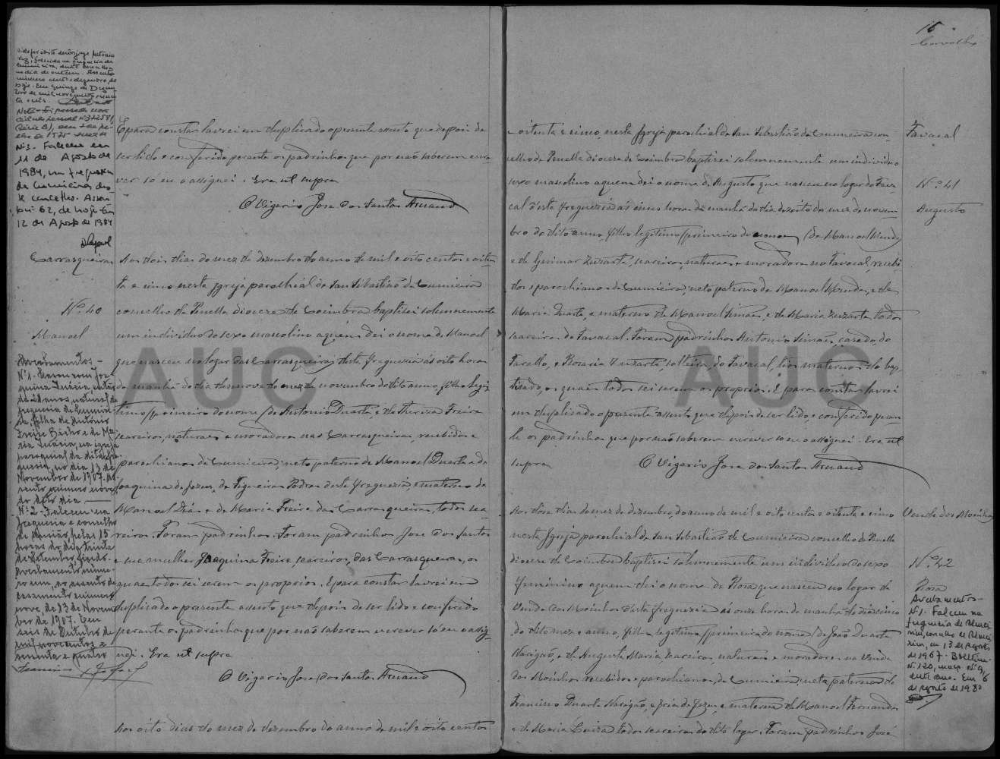

# António Duarte

**Linie:** `duarte-freire` · **Gegenlese:** offen

| | |
| --- | --- |
| Quellenname | António Duarte |
| Rolle | Vater Manuel 1885; Carrasqueiras |
| * | offen |
| † | offen |
| Eltern / genannt mit | Manoel Duarte × Joaquina de Jesus (genannt 1885) |
| Gewissheit | sicher als Vater 1885 |

Kein eigener Akt.

Ausführlich: [G3-eltern](../../../evidenz/linie-duarte/G3-eltern.md).

## Scan

Zum späteren Gegenlesen. Nicht neu datieren, nur die Handschrift halten.

