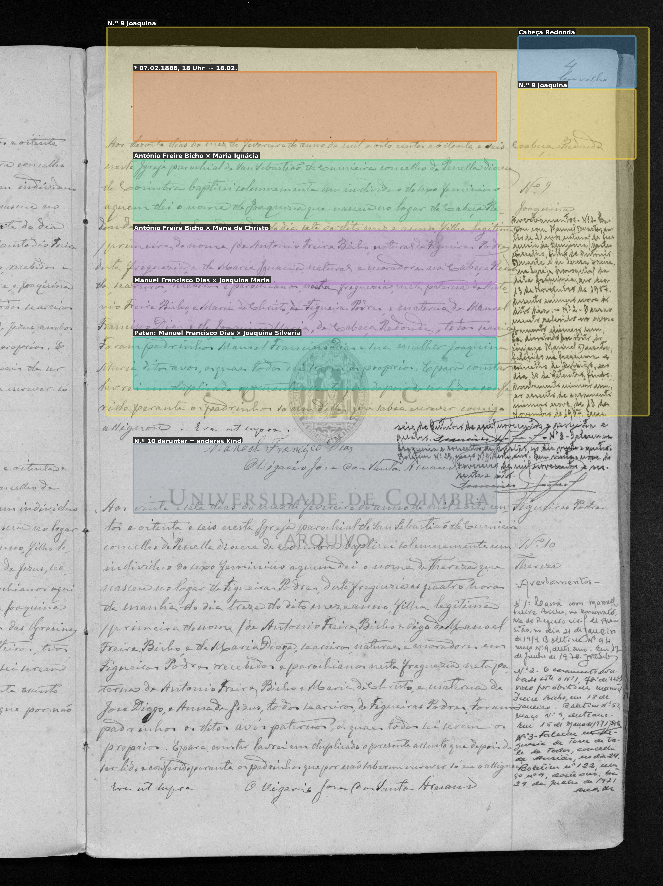
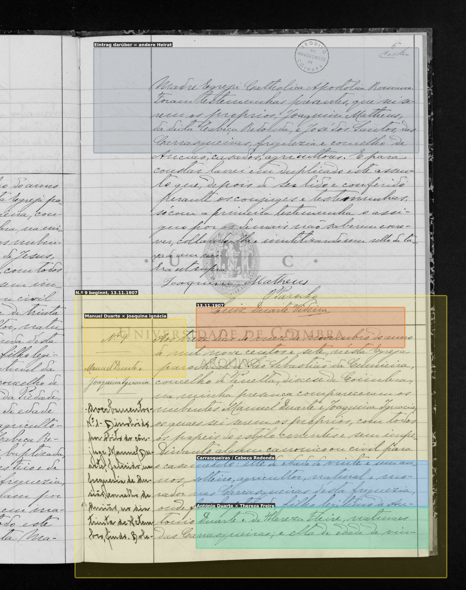
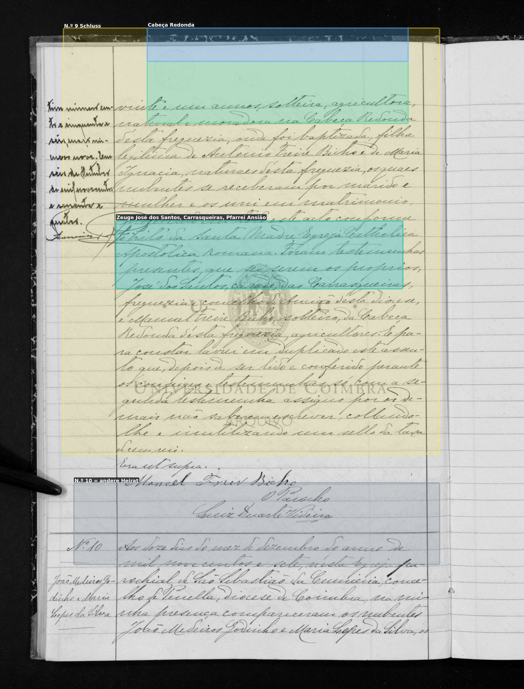

# Joaquina Ignácia

**Linie:** `duarte-freire` · **Gegenlese:** offen

| | |
| --- | --- |
| Quellenname | Joaquina (Taufe 1886); Joaquina Ignácia (Heirat 1907) |
| Rolle | bisavó, ramo paterno |
| * | 07.02.1886 · Cabeça Redonda; ~ 18.02.1886 Cumeeira N.º 9 |
| † | offen |
| Eltern / genannt mit | António Freire Bicho × Maria Ignácia |
| Gewissheit | Geburt und Heirat sicher |

Eigene Taufe hier; Heirat als Kopie. Nicht die ältere Joaquina Ignácia von 1897 (Großmutter Margaridas).

Ausführlich: [G2-joaquina-ignacia](../../../evidenz/linie-duarte/G2-joaquina-ignacia.md).

## Scan

Markierung wie bei FamilySearch: **farbige Flächen = Fundstellen** (nicht die ganze Seite). Darunter der unveränderte Scan zur Gegenlese.

🟨 Name · 🟧 Datum · 🟦 Ort · 🟩 Eltern · 🟪 Avós · 🟥 Randvermerk · 🩵 Paten (nicht Elternort)

Zum späteren Gegenlesen. Nicht neu datieren, nur die Handschrift halten.

Scan ohne Markierung — Taufe 18.02.1886

Scan ohne Markierung — Heirat 13.11.1907, Beginn

Scan ohne Markierung — Heirat 13.11.1907, Schluss

