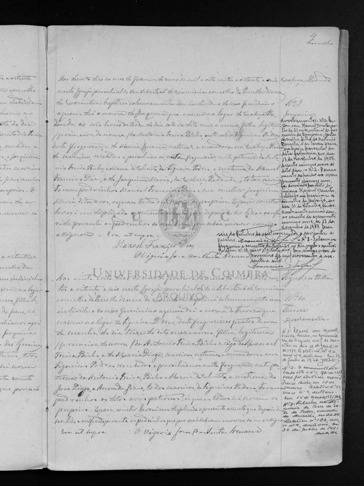

# Joaquina Silvéria

**Linie:** `duarte-freire` · **Gegenlese:** offen

| | |
| --- | --- |
| Quellenname | Joaquina Silvéria |
| Rolle | Ehefrau/Patin Manuel Francisco Dias 1886 |
| * | offen |
| † | offen |
| Gewissheit | sicher genannt 1886 als Ehefrau und Patin |

Kein eigener Akt. Ob dieselbe Frau wie Joaquina Maria / ältere Joaquina Ignácia, bleibt offen — nicht zusammenführen.

## Scan

Zum späteren Gegenlesen. Nicht neu datieren, nur die Handschrift halten.

