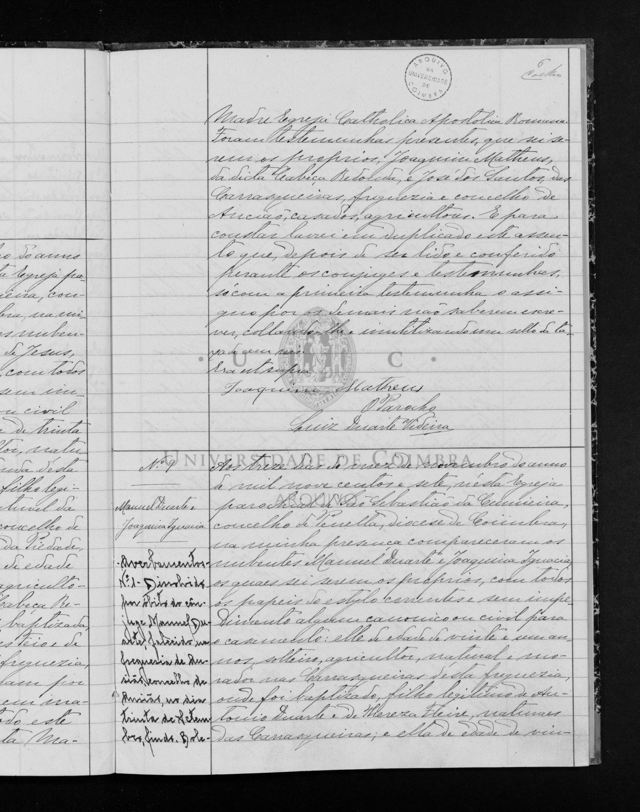
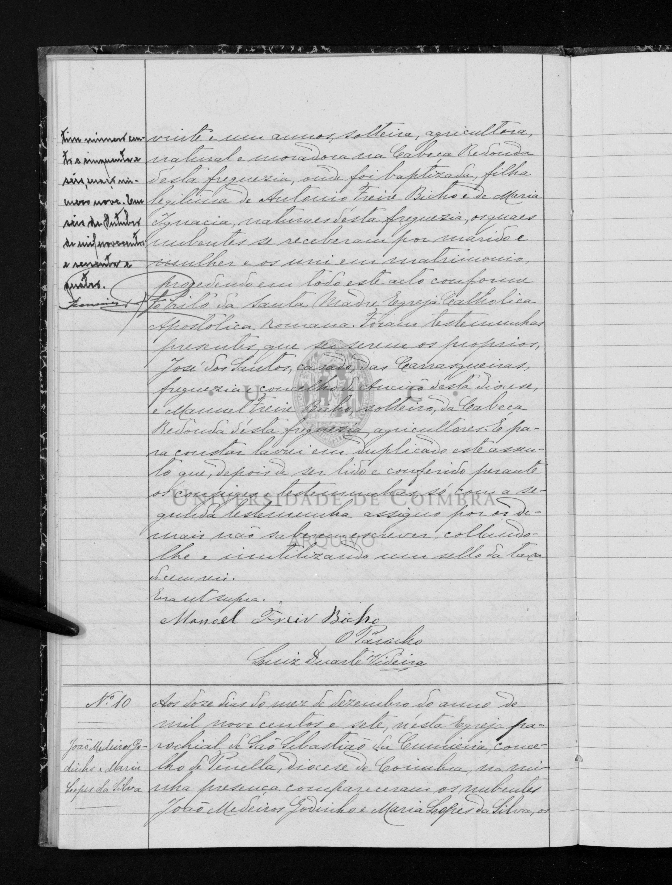

# Manuel Duarte

**Linie:** `duarte-freire` · **Gegenlese:** offen

| | |
| --- | --- |
| Quellenname | Manoel / Manuel Duarte |
| Rolle | bisavô, ramo paterno |
| * | 19.11.1885 · Carrasqueiras; ~ 02.12.1885 Cumeeira N.º 40 |
| † | 30.09.1962 · Ansião (Averbamento der Heirat; Sterbeakt nicht geprüft) |
| Eltern / genannt mit | António Duarte × Thereza Freire |
| Gewissheit | Geburt und Heirat 13.11.1907 sicher; Tod Averbamento |

Eigene Taufe und Heirat hier. Carrasqueiras = Cumeeira-Buch, nicht die Paten João 1879 (Chão de Couce). Nicht mit Teixeira (Forte) mischen.

Ausführlich: [G2-manuel-duarte](../../../evidenz/linie-duarte/G2-manuel-duarte.md).

## Scan

Zum späteren Gegenlesen. Nicht neu datieren, nur die Handschrift halten.

Siehe auch:

- [Joaquina Ignácia](../joaquina-ignacia/README.md)
