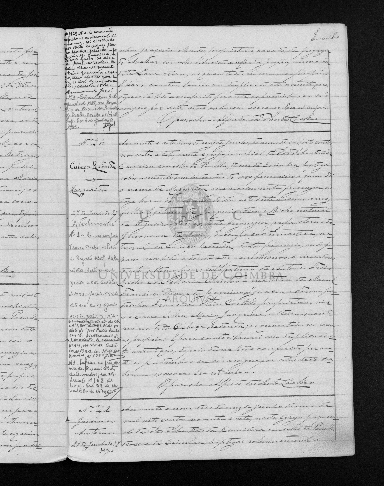

# Margarida

**Linie:** `duarte-freire` · **Gegenlese:** offen

| | |
| --- | --- |
| Quellenname | Margarida |
| Rolle | andere Freire-Bicho-Karte (nicht still = Joaquina 1886) |
| * | 27.06.1897 · Cabeça Redonda; ~ selben Tag Cumeeira N.º 21 |
| † | 29.11.1979 · Cumeeira (Rand; Zivil N.º 108). Blatt ~1979; 1972 war falsch (Tod des Mannes). |
| Eltern / genannt mit | Joaquim Freire Bicho × Genoveva de Jesus |
| Gewissheit | Geburt sicher; Tod Randvermerk |

Eigene Taufe. Heirat 28.10.1922 × José Freire Bicho — seine Geburt offen. Nicht mit João Teixeira mischen.

## Scan

Zum späteren Gegenlesen. Nicht neu datieren, nur die Handschrift halten.

