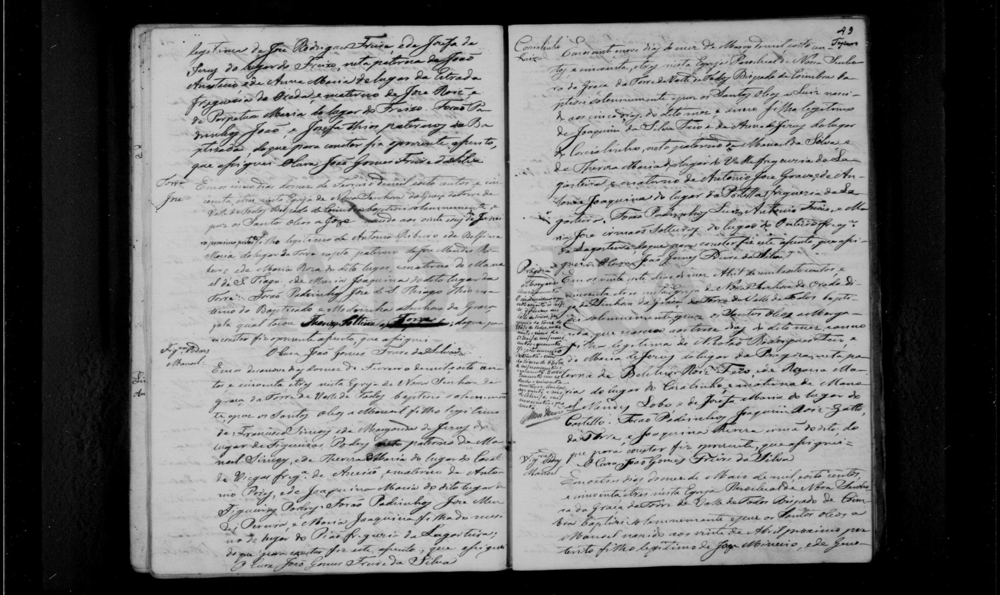

# Agueda Maria

**Linie:** `guiomar` · **Gegenlese:** offen

| | |
| --- | --- |
| Quellenname | Agueda Maria |
| Rolle | avó paterna Joaquim 1853 (neben Belchior Roiz Feio) |
| * | offen |
| † | offen |
| Gewissheit | sicher genannt 1853; nicht still = Rozaria |

Kein eigener Akt. Blatt hängt an Belchior Rosa Maria. Gegenlese: Rozaria 1824 daneben.

## Scan

Markierung wie bei FamilySearch: **farbige Flächen = Fundstellen** (nicht die ganze Seite). Darunter der unveränderte Scan zur Gegenlese.

🟨 Name · 🟧 Datum · 🟦 Ort · 🟩 Eltern · 🟪 Avós · 🟥 Randvermerk · 🩵 Paten (nicht Elternort)

Zum späteren Gegenlesen. Nicht neu datieren, nur die Handschrift halten.

Scan ohne Markierung — Taufe Enkel Joaquim 1853

Siehe auch:

- [Rozaria Maria](../rozaria-maria/README.md)
