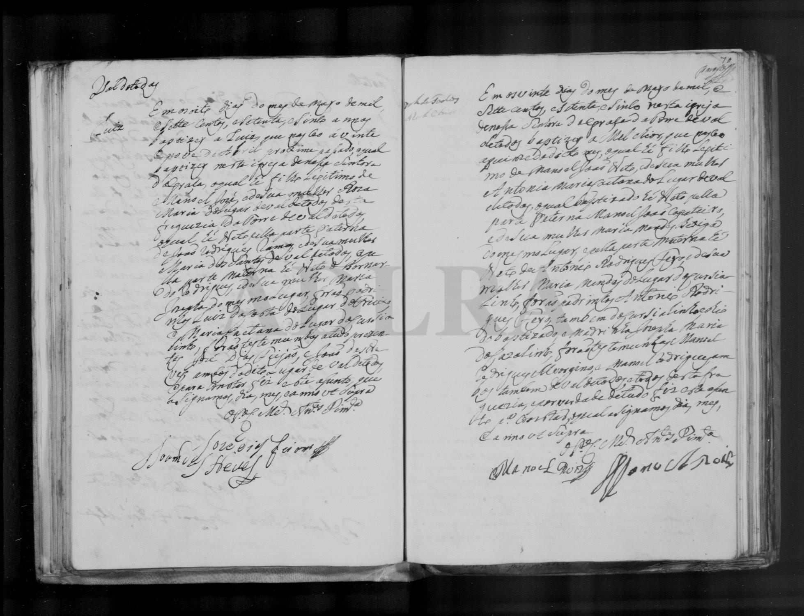

# Antonia Maria Caetana

**Linie:** `guiomar` · **Gegenlese:** offen

| | |
| --- | --- |
| Quellenname | Antonia Maria Caetana (1775); Antonia Maria (1824 avó) |
| Rolle | Mutter Melchior 1775 |
| * | offen |
| † | offen |
| Eltern / genannt mit | Antonio Rodrigues Feio × Maria Mendes, Carvalhinho |
| Gewissheit | sicher genannt 1775; nicht Victoria (A/V-Lesefehler 1824) |

Kein eigener Akt. Daher der Doppelname Rodrigues Feio beim Sohn.

Ausführlich: [melchior-1775](../../../evidenz/linie-guiomar/melchior-1775.md).

## Scan

Zum späteren Gegenlesen. Nicht neu datieren, nur die Handschrift halten.

