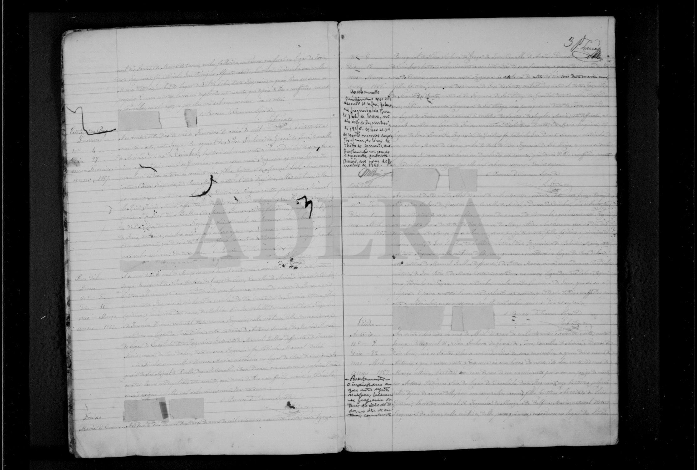
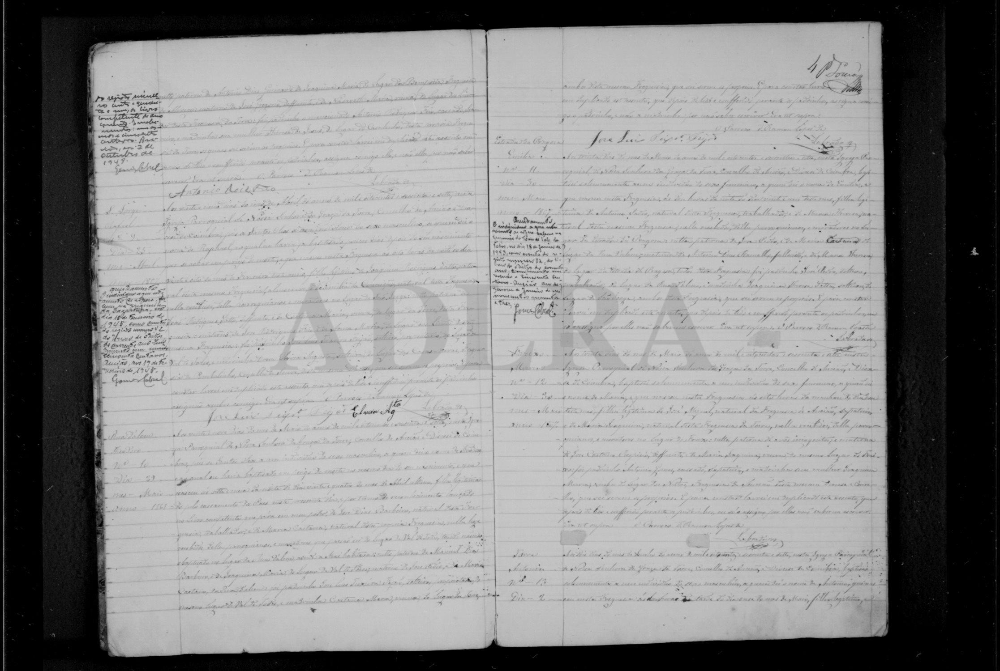

# António (Guiomar, * 1867 Lindeo)

**Linie:** `guiomar` · **Gegenlese:** offen

| | |
| --- | --- |
| Quellenname | Antonio (Taufe); António Dias Guiomar (Pass 1901) |
| Rolle | älterer Bruder João 1874; Pass 22.01.1901 |
| * | 20.04.1867 · Lindeo (Lindos), Pfarrei Torre; ~ 22.04.1867 |
| † | Rand: später in Torre — Datum Gegenlese |
| Eltern / genannt mit | Luiz Guiomar × Delfina Maria |
| Gewissheit | Taufe **sicher**. Pass 1901 dieselbe Person **wahrscheinlich** (Alter 33 im Jan. 1901) |

Eigene Taufe hier. **primeiro deste nome.** Nicht der avô Antonio Dias Guiomar × Joaquina Maria. Luiz × Delfina **haben wir**.

Avós 1867: Antonio Dias Guiomar × Joaquina Maria, **Bemposta** / Alvorge; José Gregorio, defunto × **Benedita Maria**, viúva, Lindeo. 1874 beim Bruder João steht die avó materna **Nazareth Maria** — Formen **nebeneinander**, nicht glätten.

Ausführlich: [passe-1901](../../../evidenz/linie-torre/passe-antonio-guiomar-1901.md).

## Scan

Markierung wie bei FamilySearch: **farbige Flächen = Fundstellen** (nicht die ganze Seite). Darunter der unveränderte Scan zur Gegenlese.

🟨 Name · 🟧 Datum · 🟦 Ort · 🟩 Eltern · 🟪 Avós · 🟥 Randvermerk · 🩵 Paten (nicht Elternort)

Scan ohne Markierung — Taufe 22.04.1867

Scan ohne Markierung — Fortsetzung Avós

Dieselbe rechte Seite `m0003` trägt oben **Maria** N.º 8, Haus José dos Reis × Maria Ramalha — anderes Haus, nicht vermengen.

Siehe auch:

- [Luiz Guiomar](../luiz-guiomar/README.md)
- [João 1874](../joao-guiomar-1874/README.md)
- [Anna 1869](../anna-guiomar-1869/README.md)
