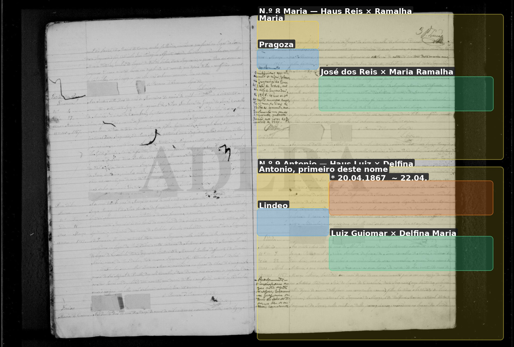
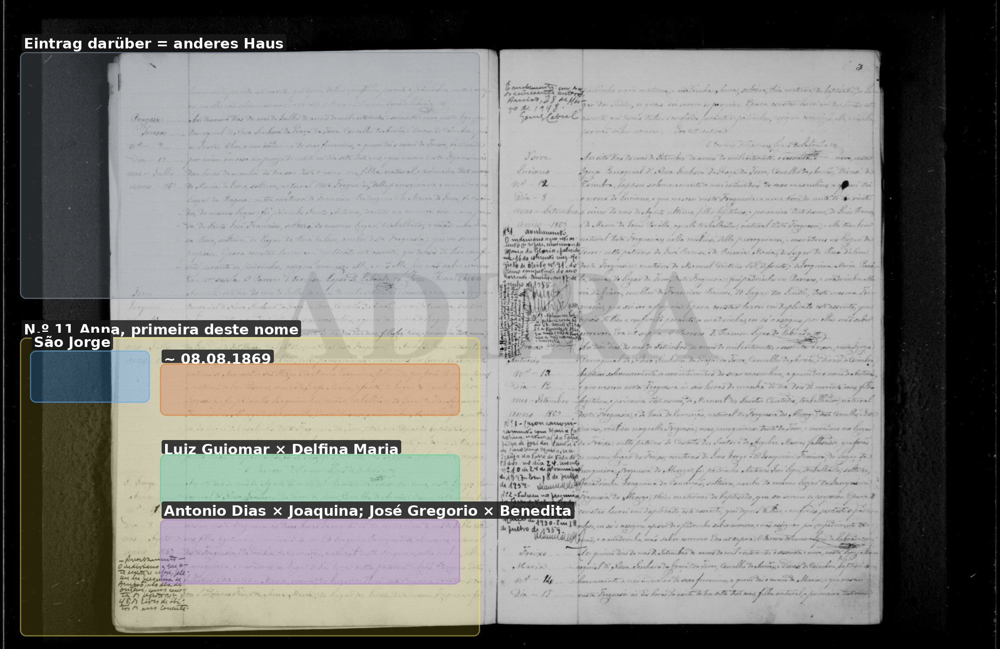
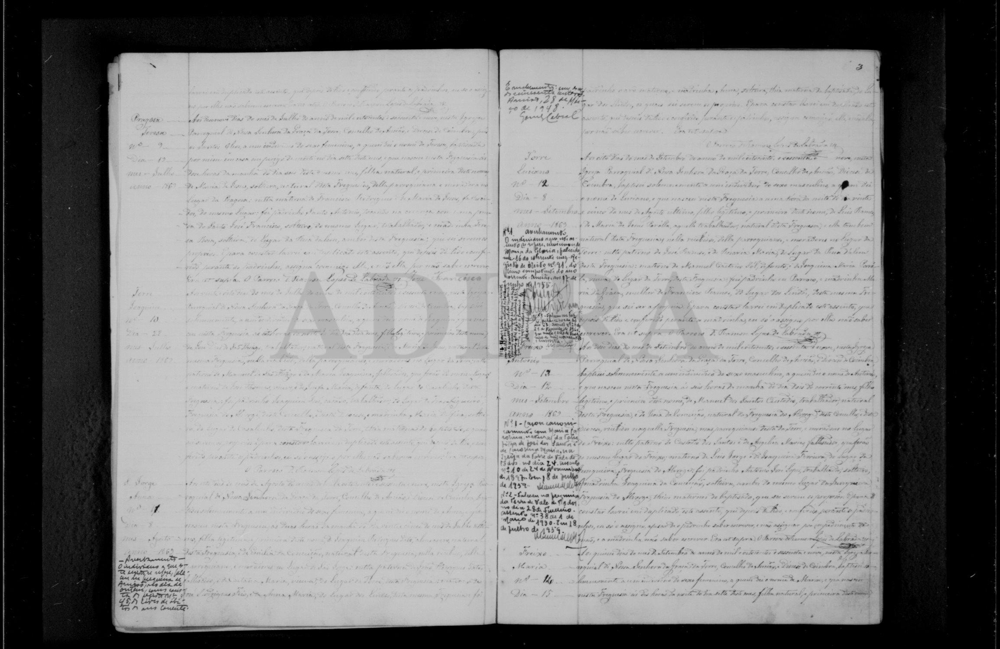

# Delfina Maria

**Linie:** `guiomar` · **Gegenlese:** offen

| | |
| --- | --- |
| Quellenname | Delfina Maria |
| Rolle | 4.º avó |
| * | Blatt Lindos; 1867/1869 wohnhaft Lindeo dann São Jorge |
| † | offen |
| Eltern / genannt mit | 1867/1869: José Gregorio, defunto × **Benedita Maria**, viúva, Lindeo. 1874: × **Nazareth Maria**. Nicht glätten. |
| Gewissheit | Paar mit Luiz **sicher** |

Kein eigener Akt. **Haben wir** als Paar. Nicht noch einmal suchen. Kinder: António 1867 Lindeo; Anna 1869 São Jorge; João 1874 Rua d'Além.

Ausführlich: [avós 1874](../../../evidenz/linie-torre/antonio-dias-guiomar-joaquina.md).

## Scan

Markierung wie bei FamilySearch: **farbige Flächen = Fundstellen** (nicht die ganze Seite). Darunter der unveränderte Scan zur Gegenlese.

🟨 Name · 🟧 Datum · 🟦 Ort · 🟩 Eltern · 🟪 Avós · 🟥 Randvermerk · 🩵 Paten (nicht Elternort)

Zum späteren Gegenlesen. Nicht neu datieren, nur die Handschrift halten.

Scan ohne Markierung — Taufe Sohn João 1874

Scan ohne Markierung — Taufe Sohn António 1867

Scan ohne Markierung — Fortsetzung Avós António 1867

Scan ohne Markierung — Taufe Tochter Anna 1869

