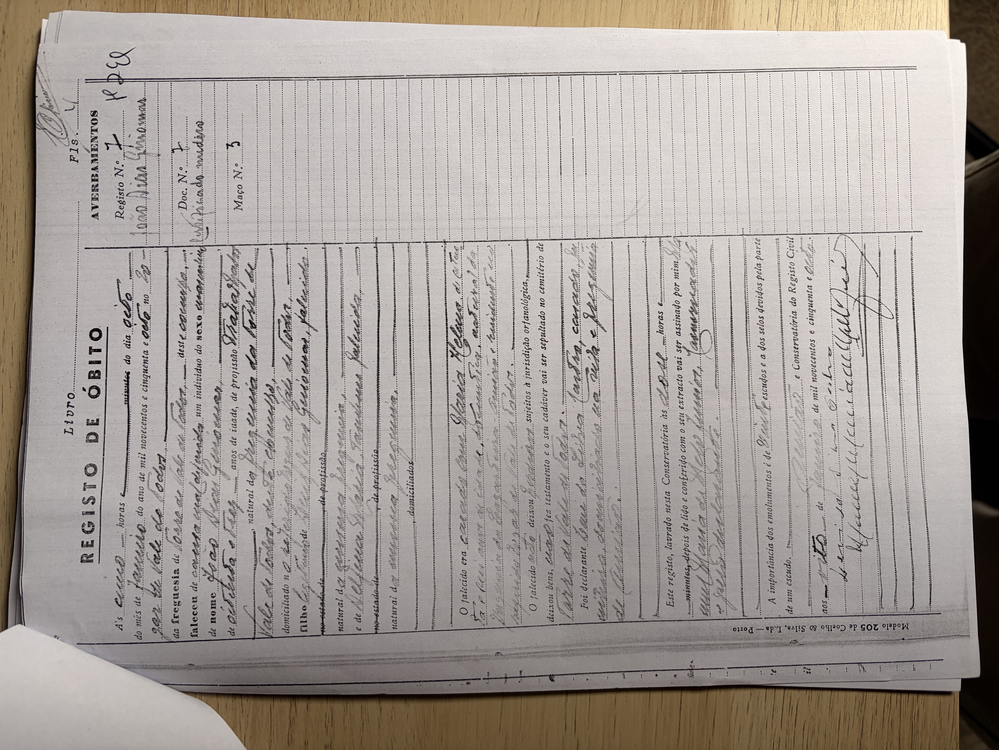

# João (Dias) Guiomar

**Linie:** `guiomar` · **Gegenlese:** offen

| | |
| --- | --- |
| Quellenname | João (Taufe ohne Dias Guiomar; Blatt João Dias Guiomar) |
| Rolle | 3.º avô, ramo materno |
| * | 22.04.1874 · Rua d'Além; ~ 10.05.1874 Torre |
| † | 08.01.1958 · Vale de Todos |
| Eltern / genannt mit | Luiz Guiomar × Delfina Maria |
| Gewissheit | Geburt und Tod sicher |

Eigene Taufe hier. Tod Conservatória `07.jpg` (nicht kopiert). Luiz × Delfina **haben wir** — nicht noch einmal suchen. Pass-António 1901 = Bruder, nicht avô.

Ausführlich: [Pass-António / Bruder](../../../evidenz/linie-torre/passe-antonio-guiomar-1901.md).

## Scan

Zum späteren Gegenlesen. Nicht neu datieren, nur die Handschrift halten.

Tod 08.01.1958 — liegt in der Conservatória, nicht hierher kopiert:

Siehe auch:

- [Frau Maria (Pião)](../maria-piao/README.md)
- [Luiz Guiomar](../luiz-guiomar/README.md)
