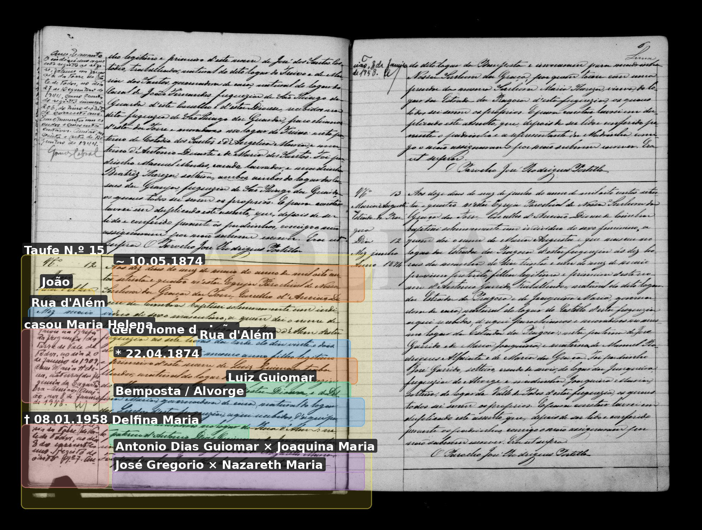

# José Gregorio

**Linie:** `guiomar` · **Gegenlese:** offen

| | |
| --- | --- |
| Quellenname | José Gregorio |
| Rolle | 5.º avô; avô materno João 1874 |
| * | offen |
| † | offen |
| Gewissheit | sicher genannt 1874; Lindos Blatt, nicht in jener Taufe |

Kein eigener Akt.

## Scan

Markierung wie bei FamilySearch: **farbige Flächen = Fundstellen** (nicht die ganze Seite). Darunter der unveränderte Scan zur Gegenlese.

🟨 Name · 🟧 Datum · 🟦 Ort · 🟩 Eltern · 🟪 Avós · 🟥 Randvermerk · 🩵 Paten (nicht Elternort)

Zum späteren Gegenlesen. Nicht neu datieren, nur die Handschrift halten.

Scan ohne Markierung — Taufe Enkel João 1874

