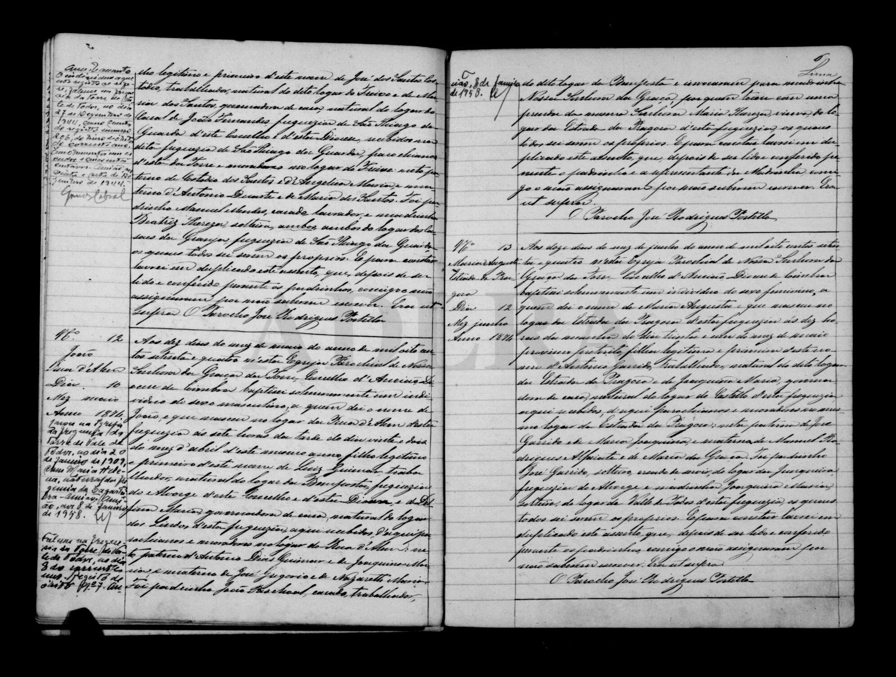
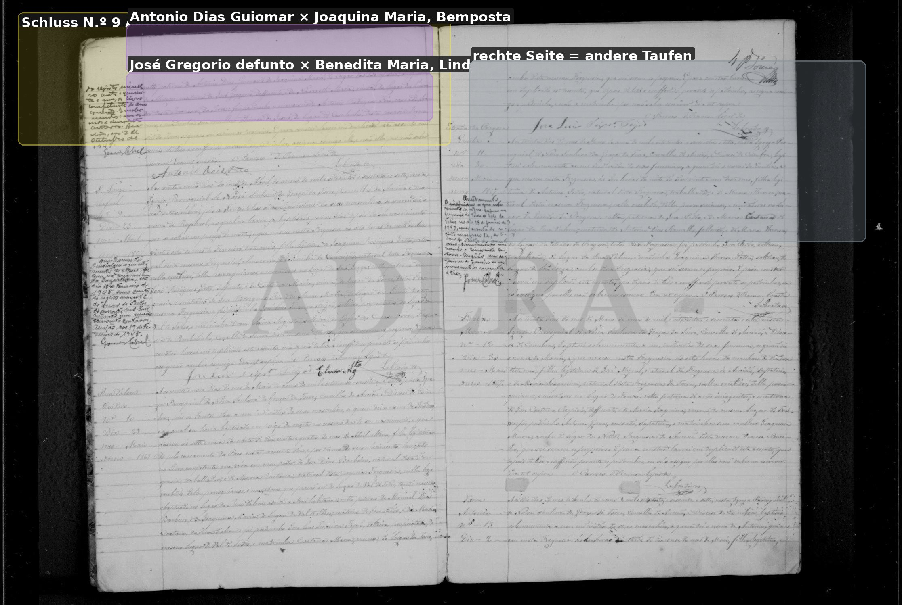

# Luiz Guiomar

**Linie:** `guiomar` · **Gegenlese:** offen

| | |
| --- | --- |
| Quellenname | Luiz Guiomar (Blatt Luiz Dias Guiomar) |
| Rolle | 4.º avô; natürlich Bemposta / Alvorge |
| * | Blatt Bat. ALV ca. 1835 — eigene Taufe offen |
| † | offen |
| Eltern / genannt mit | Antonio Dias Guiomar × Joaquina Maria (1874; 1867 Bemposta) |
| Gewissheit | Paar mit Delfina **sicher**. Kinder: António * 20.04.1867 Lindeo; Anna ~ 08.08.1869 São Jorge; João * 22.04.1874 Rua d'Além |

Kein eigener Akt von Luiz. **Haben wir** als Paar — nicht noch einmal suchen. Trauung Blatt 10.11.1859, Akte offen. 1866–70 und 1874: drei Kindertaufen gelesen.

Ausführlich: [avós Antonio × Joaquina](../../../evidenz/linie-torre/antonio-dias-guiomar-joaquina.md).

## Scan

Markierung wie bei FamilySearch: **farbige Flächen = Fundstellen** (nicht die ganze Seite). Darunter der unveränderte Scan zur Gegenlese.

🟨 Name · 🟧 Datum · 🟦 Ort · 🟩 Eltern · 🟪 Avós · 🟥 Randvermerk · 🩵 Paten (nicht Elternort)

Zum späteren Gegenlesen. Nicht neu datieren, nur die Handschrift halten.

Scan ohne Markierung — Taufe Sohn João 1874

Scan ohne Markierung — Taufe Sohn António 1867

Scan ohne Markierung — Fortsetzung Avós António 1867

Scan ohne Markierung — Taufe Tochter Anna 1869

