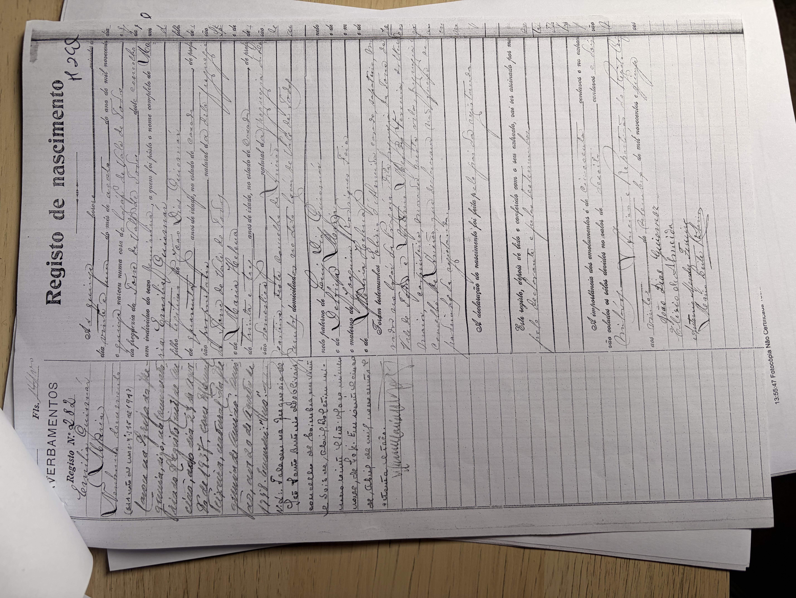

# Maria Emília Guiomar

**Linie:** `guiomar` · **Gegenlese:** offen

| | |
| --- | --- |
| Quellenname | Maria Emília Guiomar |
| Rolle | bisavó, ramo materno |
| * | 21.08.1915 · Vale de Todos |
| † | Blatt 22.04.1973 · Coimbra — hier nicht gegen Sterbeakt |
| Eltern / genannt mit | João Dias Guiomar × Maria (Pião) |
| Gewissheit | Geburt sicher (Zivil `04.jpg`); Tod Blatt |

Zivilstand nach 1911. Fotos in `archiv/conservatoria-ansiao/`. Avós/pais nicht hier.

## Scan

Zum späteren Gegenlesen. Nicht neu datieren, nur die Handschrift halten.

Geburt 21.08.1915 — liegt in der Conservatória, nicht hierher kopiert:

Heirat 23.04.1937, Beginn — liegt in der Conservatória, nicht hierher kopiert:

Heirat 23.04.1937, Schluss — liegt in der Conservatória, nicht hierher kopiert:

Siehe auch:

- [Vater João](../joao-guiomar-1874/README.md)
- [Mann Manuel Teixeira](../../teixeira/manuel-teixeira-1913/README.md)
