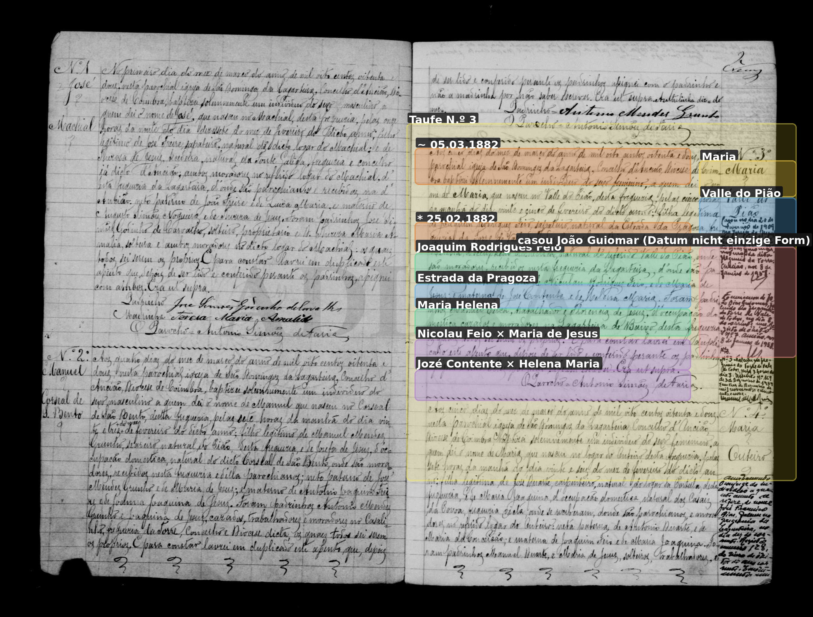
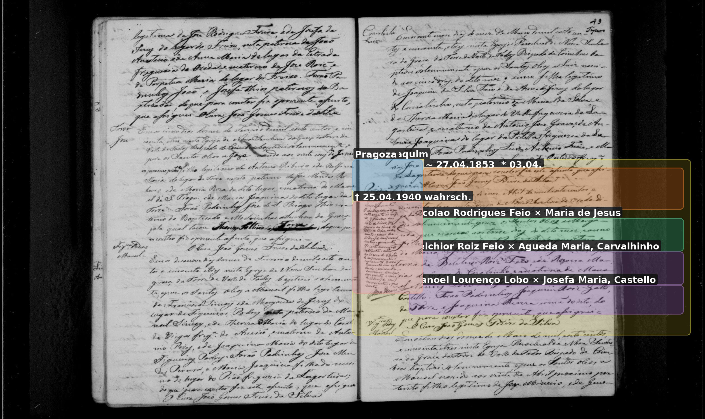

# Maria (Pião / Helena Guiomar)

**Linie:** `guiomar` · **Gegenlese:** offen

| | |
| --- | --- |
| Quellenname | Maria (Taufe; Blatt Maria Helena Guiomar) |
| Rolle | 3.º avó, ramo materno |
| * | 25.02.1882 · Valle do Pião; ~ 05.03.1882 Lagarteira N.º 3 |
| † | offen |
| Eltern / genannt mit | Joaquim Rodrigues Feio × Maria Helena |
| Gewissheit | Geburt sicher; Taufname Maria, nicht Helena/Guiomar |

Eigene Taufe hier. Helena = Mutter; Guiomar = späterer Ehename. Contente bleibt in Pião.

Ausführlich: [feio-contente](../../../evidenz/linie-guiomar/feio-contente.md).

## Scan

Markierung wie bei FamilySearch: **farbige Flächen = Fundstellen** (nicht die ganze Seite). Darunter der unveränderte Scan zur Gegenlese.

🟨 Name · 🟧 Datum · 🟦 Ort · 🟩 Eltern · 🟪 Avós · 🟥 Randvermerk · 🩵 Paten (nicht Elternort)

Zum späteren Gegenlesen. Nicht neu datieren, nur die Handschrift halten.

Scan ohne Markierung — Taufe 05.03.1882 Lagarteira

Scan ohne Markierung — Taufe des Vaters Joaquim 1853

Siehe auch:

- [Mann João Guiomar](../joao-guiomar-1874/README.md)
