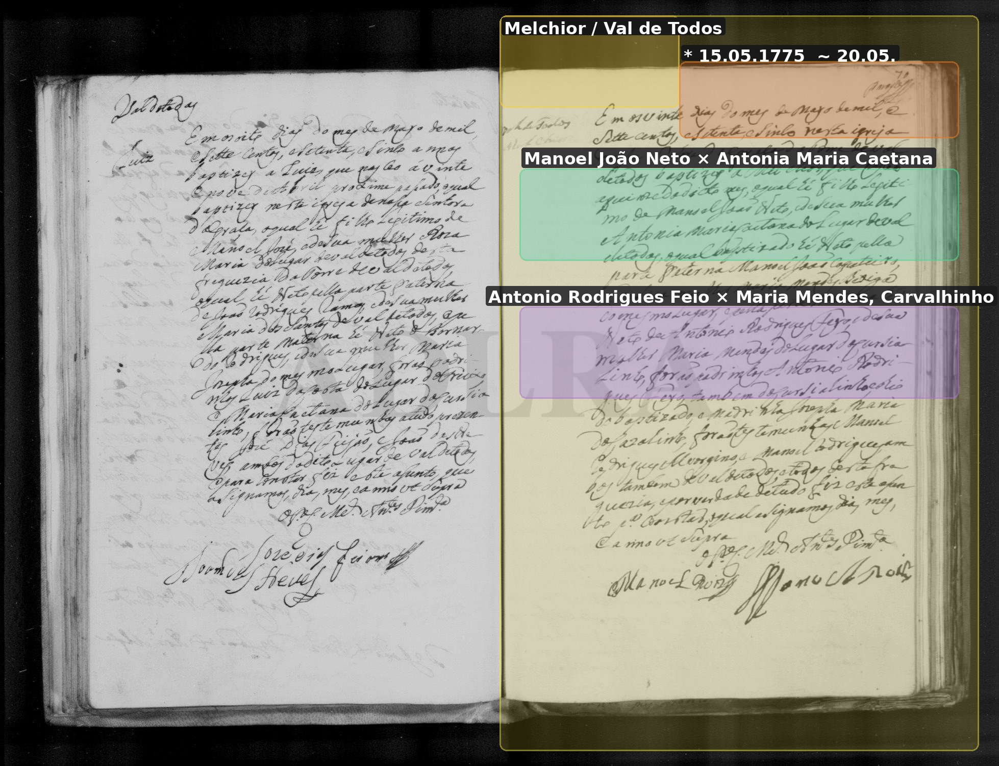
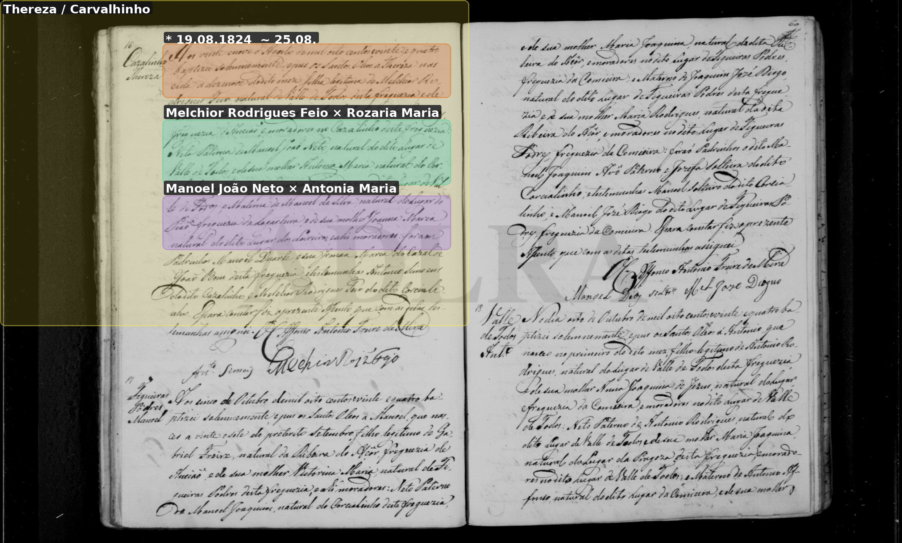

# Melchior / Belchior Rodrigues Feio

**Linie:** `guiomar` · **Gegenlese:** offen

| | |
| --- | --- |
| Quellenname | Melchior (1775); Belchior Roiz Feio (1853 als avô) |
| Rolle | avô des Joaquim Feio; * 15.05.1775 Val de Todos |
| * | 15.05.1775 · Val de Todos; ~ 20.05.1775 Torre |
| † | offen |
| Eltern / genannt mit | Manoel João Neto × Antonia Maria Caetana |
| Gewissheit | Taufe sicher; Identität mit Belchior 1853 wahrscheinlich (Rosa ≈ Rozaria) |

Eigene Taufe hier. 1853 hängt an Belchior Agueda Maria; 1824 Frau Rozaria Maria. Formen daneben, nicht glätten.

Ausführlich: [melchior-1775](../../../evidenz/linie-guiomar/melchior-1775.md).

## Scan

Markierung wie bei FamilySearch: **farbige Flächen = Fundstellen** (nicht die ganze Seite). Darunter der unveränderte Scan zur Gegenlese.

🟨 Name · 🟧 Datum · 🟦 Ort · 🟩 Eltern · 🟪 Avós · 🟥 Randvermerk · 🩵 Paten (nicht Elternort)

Zum späteren Gegenlesen. Nicht neu datieren, nur die Handschrift halten.

Scan ohne Markierung — Taufe 20.05.1775

Scan ohne Markierung — Taufe Tochter Theresa 1824

Siehe auch:

- [Theresa 1824](../theresa-carvalhinho/README.md)
