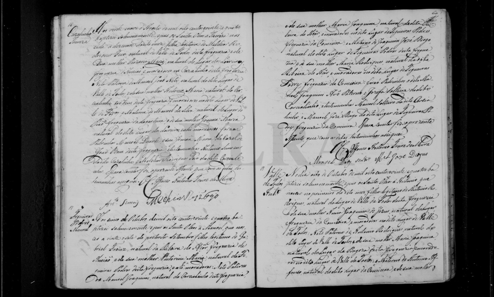

# Theresa (Carvalhinho, 1824)

**Linie:** `guiomar` · **Gegenlese:** offen

| | |
| --- | --- |
| Quellenname | Thereza / Theresa |
| Rolle | Tochter Melchior × Rozaria; Schwester des Nicolao (wahrscheinlich) |
| * | 19.08.1824 · Carvalhinho; ~ 25.08.1824 Torre |
| † | offen |
| Eltern / genannt mit | Melchior Rodrigues Feio × Rozaria Maria |
| Gewissheit | Taufe sicher; Schwester Nicolao wahrscheinlich |

Eigene Taufe. Nicht Vorfahrin auf dem Blatt, aber der Scan muss später nochmals gelesen werden (Tür 1700–1800).

Ausführlich: [melchior-feio-1824](../../../evidenz/linie-guiomar/melchior-feio-1824.md).

## Scan

Markierung wie bei FamilySearch: **farbige Flächen = Fundstellen** (nicht die ganze Seite). Darunter der unveränderte Scan zur Gegenlese.

🟨 Name · 🟧 Datum · 🟦 Ort · 🟩 Eltern · 🟪 Avós · 🟥 Randvermerk · 🩵 Paten (nicht Elternort)

Zum späteren Gegenlesen. Nicht neu datieren, nur die Handschrift halten.

Scan ohne Markierung — Taufe 25.08.1824

