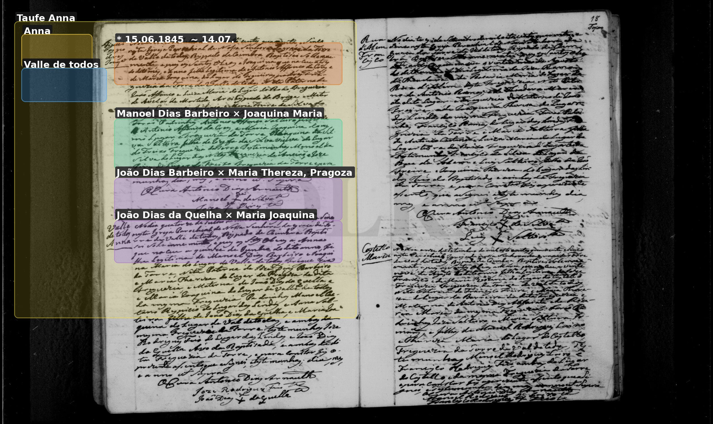

# João Dias Barbeiro

**Linie:** `jose-maria` · **Gegenlese:** offen

| | |
| --- | --- |
| Quellenname | João Dias Barbeiro |
| Rolle | avô paterno Anna 1845; Pragoza |
| * | offen |
| † | offen |
| Gewissheit | sicher genannt 1845 |

Kein eigener Akt.

## Scan

Markierung wie bei FamilySearch: **farbige Flächen = Fundstellen** (nicht die ganze Seite). Darunter der unveränderte Scan zur Gegenlese.

🟨 Name · 🟧 Datum · 🟦 Ort · 🟩 Eltern · 🟪 Avós · 🟥 Randvermerk · 🩵 Paten (nicht Elternort)

Zum späteren Gegenlesen. Nicht neu datieren, nur die Handschrift halten.

Scan ohne Markierung — Taufe Enkelin Anna 1845

