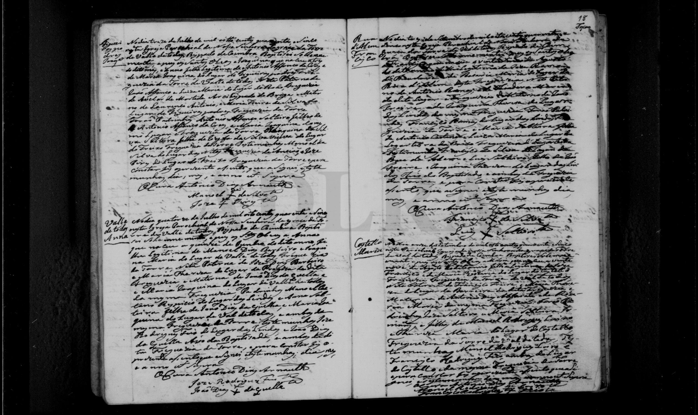

# Joaquina Maria Neta

**Linie:** `jose-maria` · **Gegenlese:** offen

| | |
| --- | --- |
| Quellenname | Joaquina Maria (1845); Joaquina Maria Neta (1880) |
| Rolle | 5.º avó; Frau Manoel Dias Barbeiro |
| * | offen |
| † | offen |
| Eltern / genannt mit | João Dias da Quelha × Maria Joaquina (genannt 1845) |
| Gewissheit | Paar sicher; Zweitname Neta 1880, nicht 1845 |

Kein eigener Akt. Blatt Joaquina de Jesus daneben. Nicht mit anderen Joaquina Maria mergen.

## Scan

Markierung wie bei FamilySearch: **farbige Flächen = Fundstellen** (nicht die ganze Seite). Darunter der unveränderte Scan zur Gegenlese.

🟨 Name · 🟧 Datum · 🟦 Ort · 🟩 Eltern · 🟪 Avós · 🟥 Randvermerk · 🩵 Paten (nicht Elternort)

Zum späteren Gegenlesen. Nicht neu datieren, nur die Handschrift halten.

Scan ohne Markierung — Taufe Tochter Anna 1845

