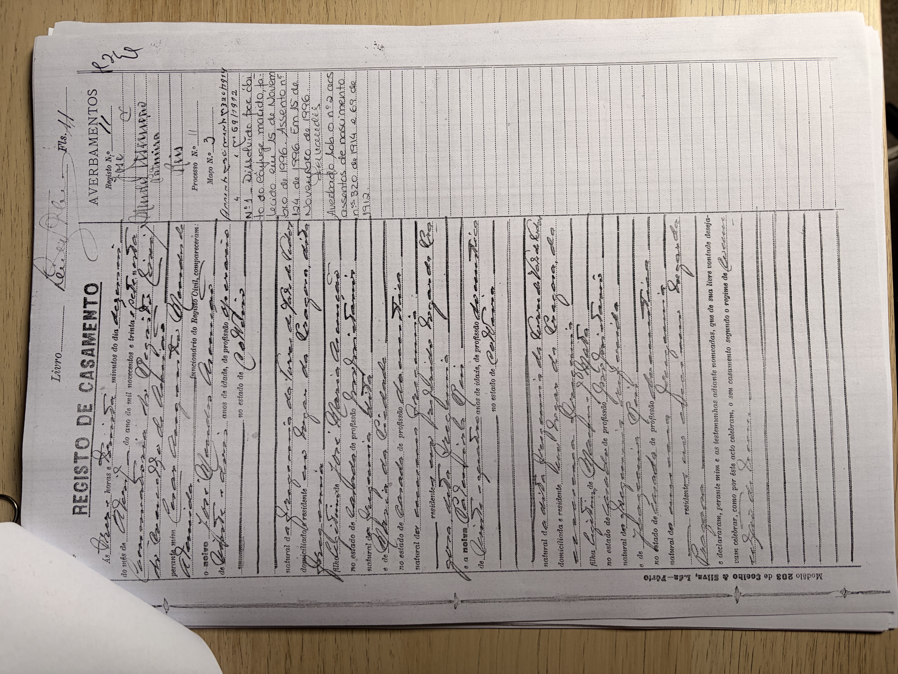
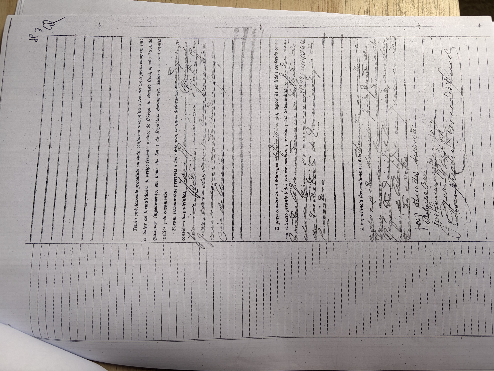

# José Mendes d'Ascensão (* 1914)

**Linie:** `jose-maria` · **Gegenlese:** offen

| | |
| --- | --- |
| Quellenname | José Mendes Ascenção (Heirat 1937) |
| Rolle | bisavô, ramo materno |
| * | 1914 · Pragoza (N.º 320/1914 — hier kein Foto) |
| † | Blatt 15.11.1996 · São Jorge — hier nicht gegen Akt |
| Eltern / genannt mit | Joze Maria da Ascenção × Maria da Piedade |
| Gewissheit | Heirat 19.04.1937 sicher; eigene Geburt ohne Foto |

Zivilstand. Heirat beide Pragoza. São Jorge = Kapelle in Vale de Todos.

## Scan

Zum späteren Gegenlesen. Nicht neu datieren, nur die Handschrift halten.

Heirat 19.04.1937, Beginn — liegt in der Conservatória, nicht hierher kopiert:

Heirat 19.04.1937, Schluss — liegt in der Conservatória, nicht hierher kopiert:

Siehe auch:

- [Frau Palmira Reis 1912](../../matta/palmira-reis-1912/README.md)
