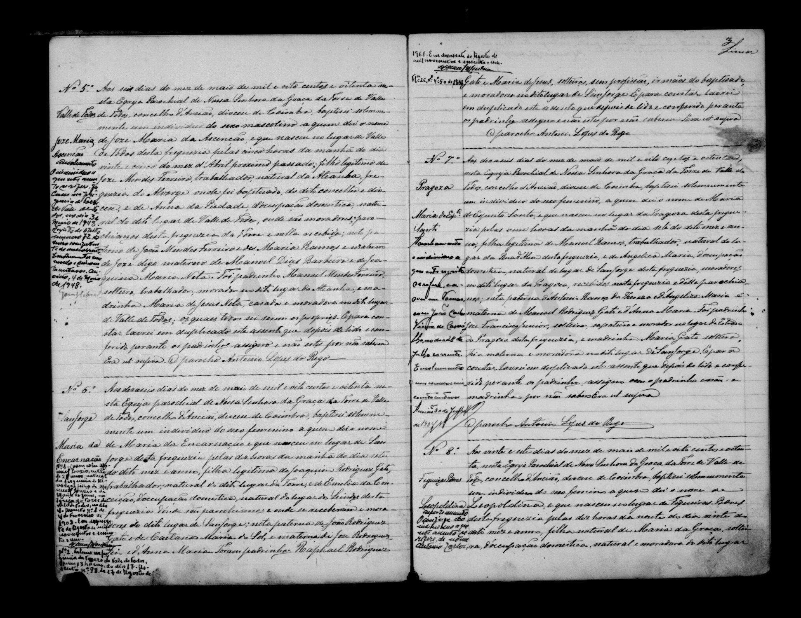

# Joze Mendes Ferreira

**Linie:** `jose-maria` · **Gegenlese:** offen

| | |
| --- | --- |
| Quellenname | Joze Mendes Ferreira (Pass 1902 Ferreiro) |
| Rolle | 4.º avô; natürlich Atanha / Alvorge |
| * | offen (Atanha) |
| † | Blatt † 1913 — hier nicht gegen Akt |
| Eltern / genannt mit | João Mendes Ferreira × Maria Ramos (genannt 1880) |
| Gewissheit | sicher als Vater 1880; Blatt Chão de Couce daneben (Paten-Pfarrei João 1879, anderes Haus) |

Kein eigener Akt. Mendes-Haus sitzt in Ateanha. Pate 1880 Manuel Mendes Ferreira noch dort.

## Scan

Markierung wie bei FamilySearch: **farbige Flächen = Fundstellen** (nicht die ganze Seite). Darunter der unveränderte Scan zur Gegenlese.

🟨 Name · 🟧 Datum · 🟦 Ort · 🟩 Eltern · 🟪 Avós · 🟥 Randvermerk · 🩵 Paten (nicht Elternort)

Zum späteren Gegenlesen. Nicht neu datieren, nur die Handschrift halten.

Scan ohne Markierung — Taufe Sohn Joze Maria 1880

