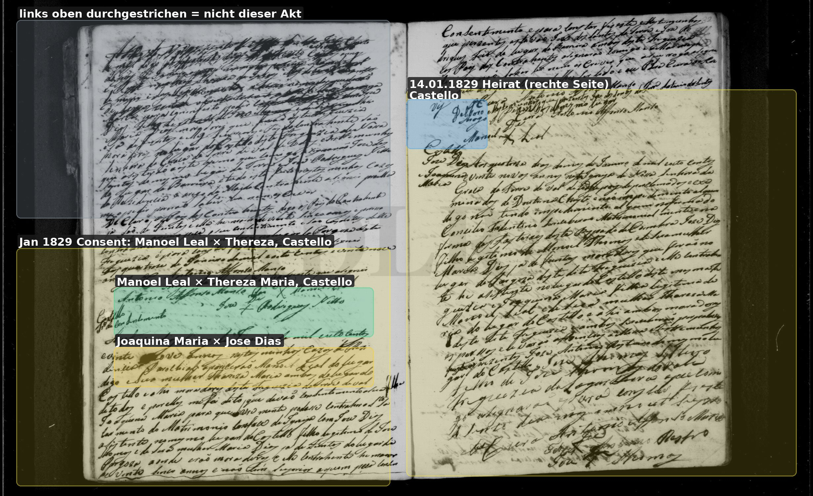
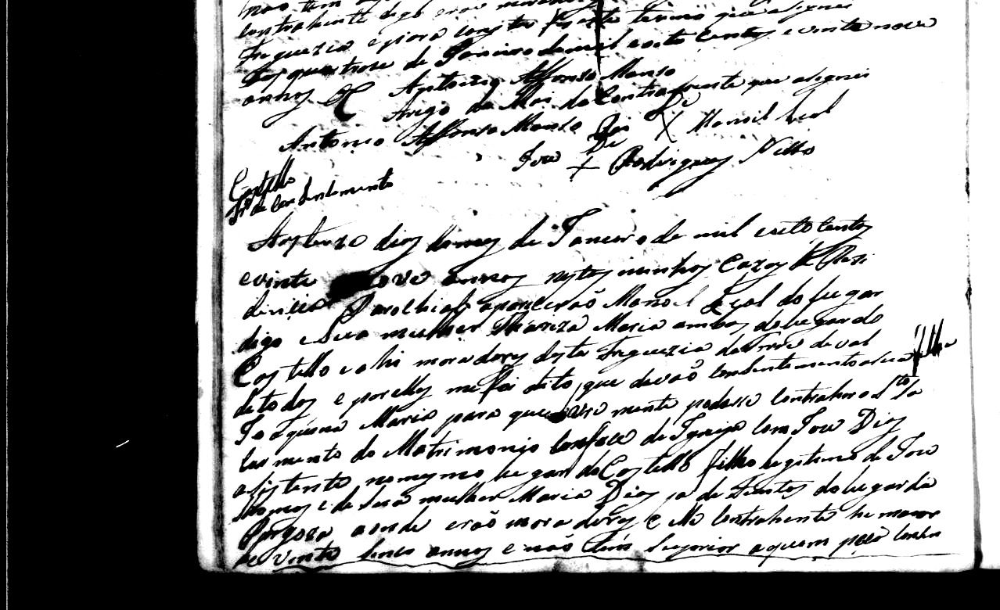
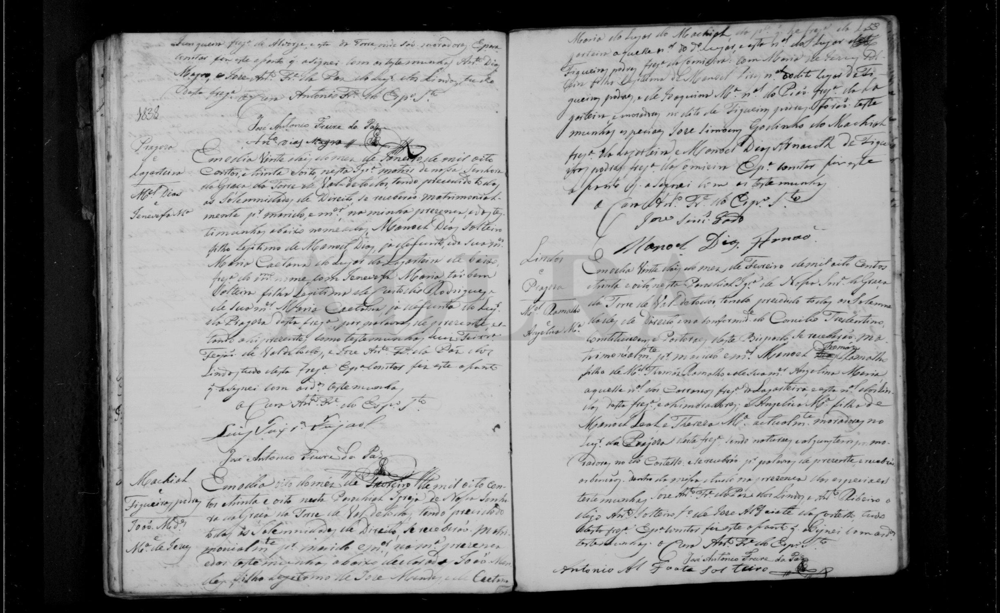
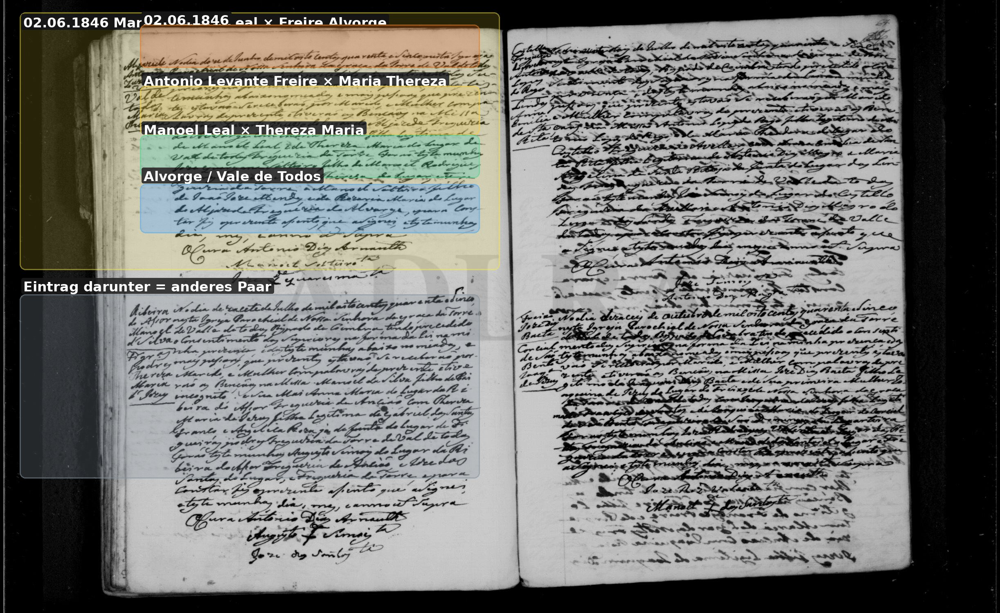
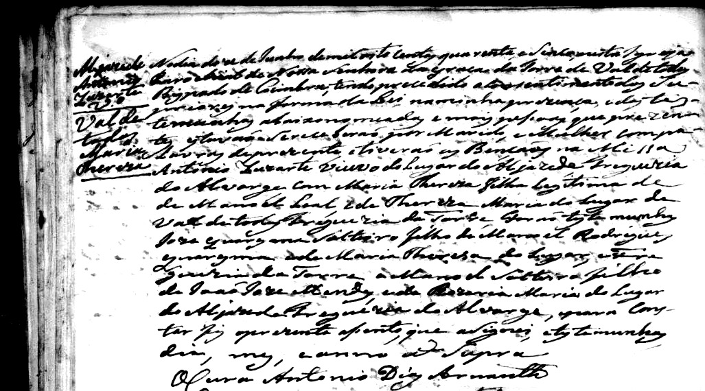

# Angelica Maria

**Linie:** `matta` · **Gegenlese:** offen

| | |
| --- | --- |
| Quellenname | Angelica Maria (1871 viúva; Blatt Angelica Maria Leal) |
| Rolle | avó materna Sebastião 1871; Patin 1871 |
| * | offen |
| † | offen (1871 bereits Witwe) |
| Gewissheit | sicher genannt 1871; **Leal** 1838 als Vater **Manoel Leal** |

Heirat Feb. **1838** Torre (Lesungen 21. oder 22., Gegenlese):
Angelica M., filha de **Manoel Leal** × Thereza M., moradora Castello.
**Kandidat** dieselbe Frau wie avó 1863/1871. Dias steht 1838 nicht.
Ateanha steht nicht.

Sohn **José * 15.08.1841** (primeiro) und **José * 02.06.1843**
(Kandidat segundo). Avós immer Leal.

Schwestern in Torre-Heiraten: Joaquina × Jose Dias **1829**
Castello; Maria Thereza × Freire **1846** (er aus Alvorge).

## Scan

Markierung wie bei FamilySearch: **farbige Flächen = Fundstellen** (nicht die ganze Seite). Darunter der unveränderte Scan zur Gegenlese.

🟨 Name · 🟧 Datum · 🟦 Ort · 🟩 Eltern · 🟪 Avós · 🟥 Randvermerk · 🩵 Paten (nicht Elternort)

Zum späteren Gegenlesen. Nicht neu datieren, nur die Handschrift halten.

Scan ohne Markierung — Schwester Joaquina 1829

Ausschnitt (Kontrast):

Scan ohne Markierung — Heirat 21.02.1838

Ausschnitt (Kontrast):

Scan ohne Markierung — Schwester Maria Thereza 1846 (Freire, Alvorge)

Ausschnitt (Kontrast):

Scan ohne Markierung — Taufe Sohn José 02.06.1843 (Kandidat)

Scan ohne Markierung — Taufe Enkel Sebastião 1871

