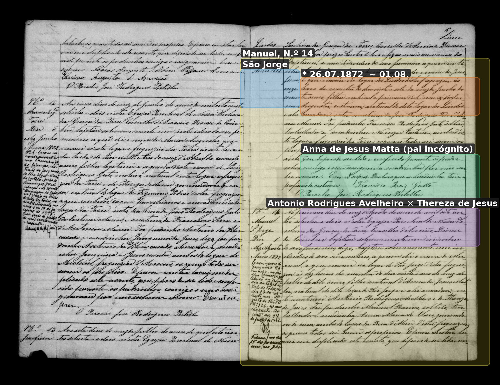
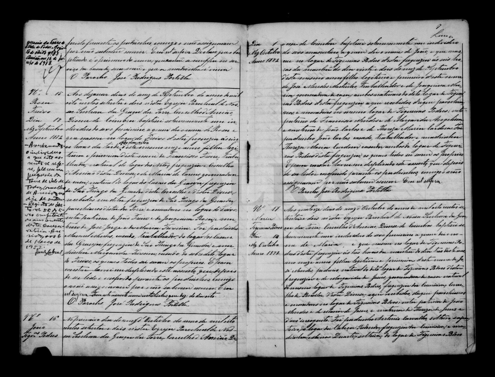

# Anna de Jesus Matta

**Linie:** `matta` · **Gegenlese:** offen

| | |
| --- | --- |
| Quellenname | Anna de Jesus Matta |
| Rolle | 4.º avó; São Jorge; Mutter Manuel (pai incógnito) |
| * | Blatt ca. 1849 |
| † | Blatt 06.02.1904 · S. Jorge; 1912 bereits tot passt zur Richtung |
| Eltern / genannt mit | Antonio Rodrigues Avelheiro × Thereza de Jesus (genannt 1872) |
| Gewissheit | sicher als Mutter 1872; eigene Akte offen |

Kein eigener Akt. `Matta` steht 1872 bei ihr, nicht als Taufname des Sohnes. Großvater Lesung Avelheiro / Molheiro — Gegenlese.

## Scan

Markierung wie bei FamilySearch: **farbige Flächen = Fundstellen** (nicht die ganze Seite). Darunter der unveränderte Scan zur Gegenlese.

🟨 Name · 🟧 Datum · 🟦 Ort · 🟩 Eltern · 🟪 Avós · 🟥 Randvermerk · 🩵 Paten (nicht Elternort)

Zum späteren Gegenlesen. Nicht neu datieren, nur die Handschrift halten.

Scan ohne Markierung — Taufe Sohn Manuel 1872

Scan ohne Markierung — Taufe, Folgeseite

