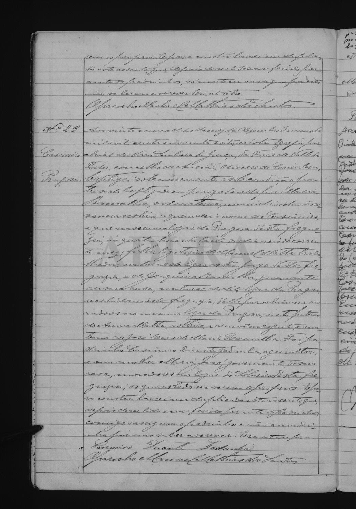

# Casimiro (* 1898 Pragoza)

**Linie:** `matta` · **Gegenlese:** offen (Scan blass)

| | |
| --- | --- |
| Quellenname | Casimiro |
| Rolle | Sohn Manuel Matta × Joaquina Ramalha; nach Palmyra 1897 |
| * | **26.12.1898**, 16 Uhr · Pragoza; Taufe selben Tag, Torre N.º 23 |
| † | offen |
| Eltern / genannt mit | Manuel Matta (nat. São Jorge) × Joaquina Ramalha (nat. und moradora Pragoza) |
| Gewissheit | Paar und Ort **sicher**. Tag und Nottaufe **wahrscheinlich** (Handschrift blass) |

Nicht der Casimiro * 25.02.1872 (filho natural der Maria Rosa de Jesus).
Nicht weiter nach Palmyra-Geschwistern suchen — Auftraggeber: Palmira
jetzt nicht.

Avós: Anna Matta + avô incógnito; José Reis × Maria Ramalha.
Nottaufe durch Maria Ramalha (Lesung Gegenlese).

Quelle: `PT/ADLRA/PRQ/PANS08/001/0043`, `m0019` linke Seite;
[DigitArq](https://digitarq.arquivos.pt/documentDetails/adb7b416da074065a00f91770bf8bc79).

## Scan

Markierung wie bei FamilySearch: **farbige Flächen = Fundstellen** (nicht die ganze Seite). Darunter der unveränderte Scan zur Gegenlese.

🟨 Name · 🟧 Datum · 🟦 Ort · 🟩 Eltern · 🟪 Avós · 🟥 Randvermerk · 🩵 Paten (nicht Elternort)

Scan ohne Markierung — Taufe 26.12.1898

Siehe auch:

- [Joaquina Ramalha](../joaquina-ramalha/README.md)
- [Manuel Matta](../manuel-matta/README.md)
