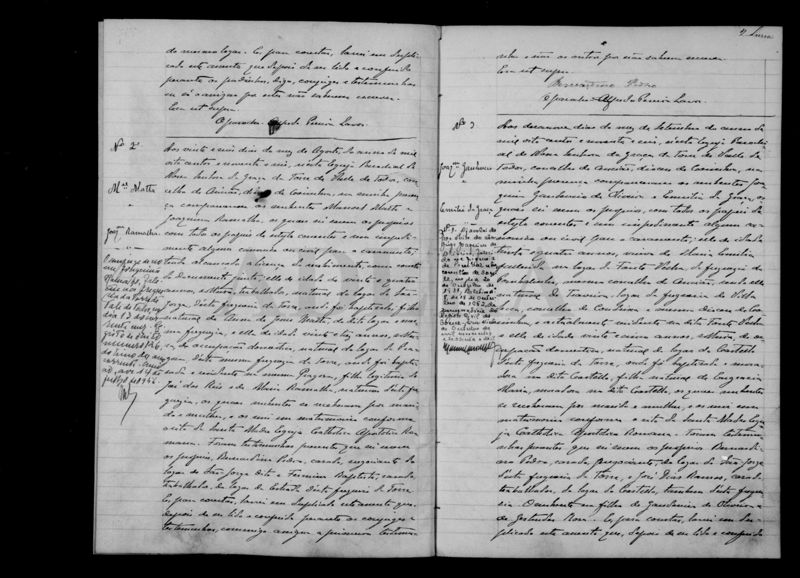
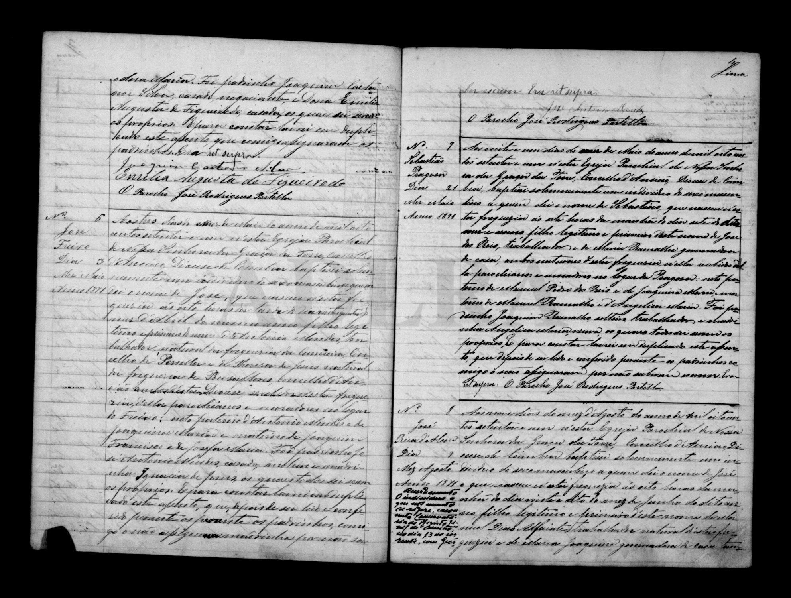
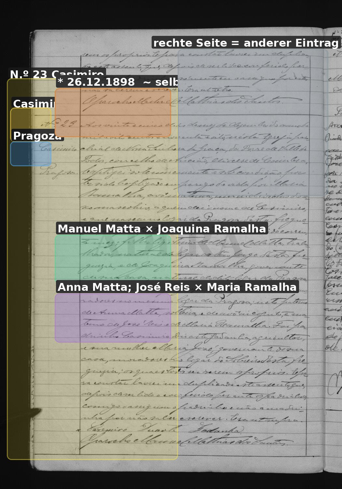
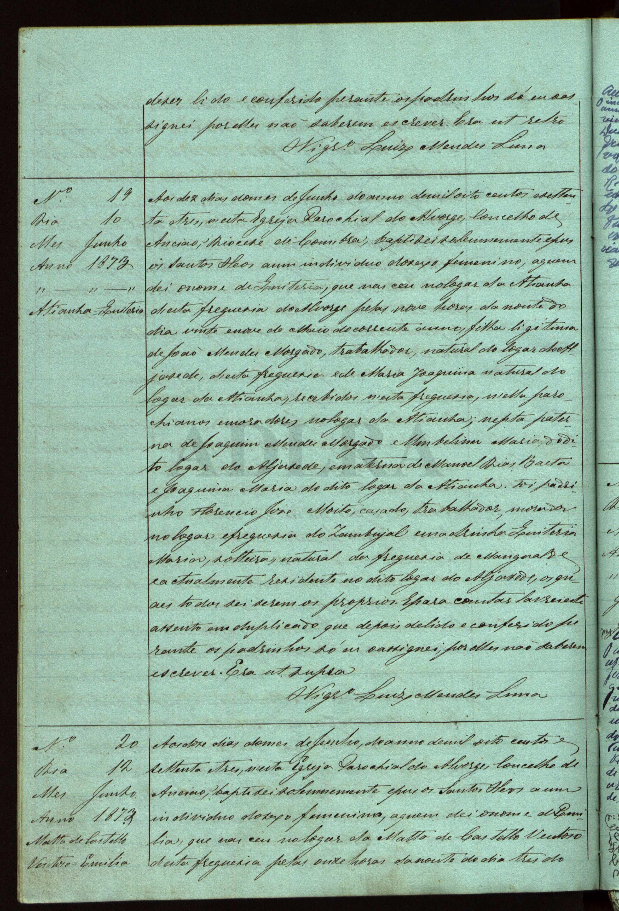
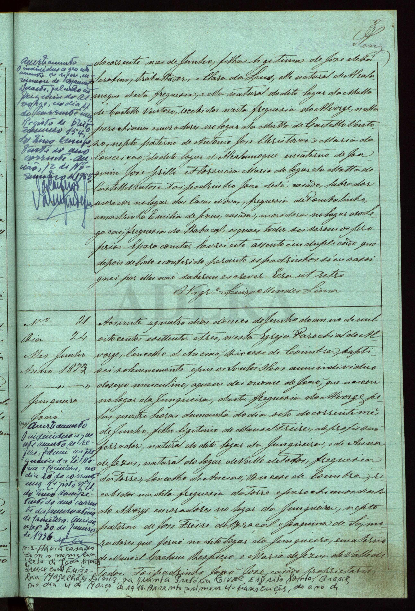
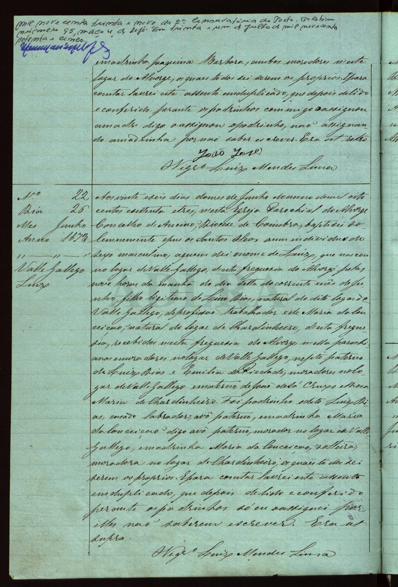
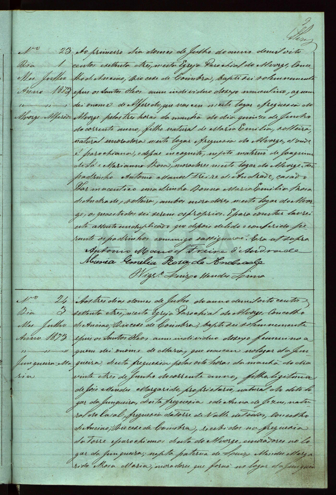
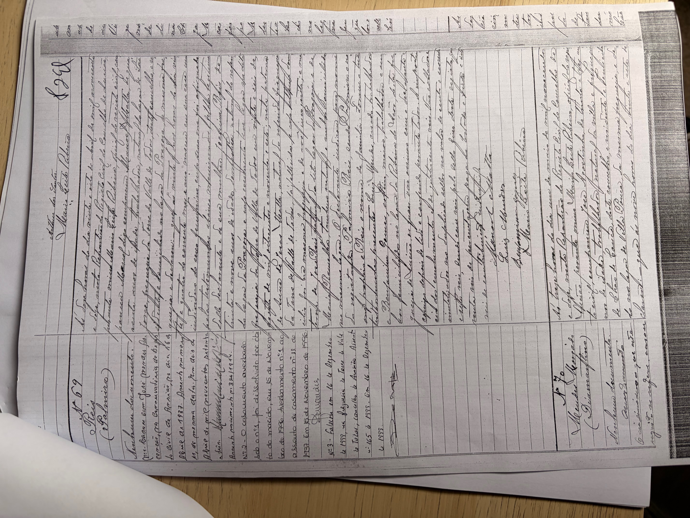

# Joaquina Ramalha / Reis

**Linie:** `matta` · **Gegenlese:** offen

| | |
| --- | --- |
| Quellenname | Joaquina Ramalha (1896); Joaquina Reis (1912) |
| Rolle | 3.º avó; Pragoza |
| * | **15.06.1873** · Pragosa — **Blatt, haben wir** |
| † | offen |
| Eltern / genannt mit | José dos Reis × Maria Ramalha |
| Gewissheit | Geburt **Blatt** (Auftraggeber). Heirat und Eltern 1896 **sicher**. Leal steht 1896 nicht. |

Geburt nicht noch einmal suchen. Taufe — wenn — **um den 15.06.1873**,
nicht ± Jahre. Ramalha **nicht aus Torre** (Auftraggeber); Torre ist
Heirat der Mutter 1863 und Geschwister, nicht die Herkunft. Torre 1873
ohne diesen Eintrag. **Alvorge / Ateanha Juni 1873** ganz gelesen: kein
Joaquina-Akt am 15.06. (N.º 19–22 andere Häuser). Auftraggeber:
Herkunft **Ateanha** — **Kandidat**; 1863/1875 schreiben **Castello**.
Nicht glätten. Geschwister **haben wir**. Heirat physisch auch bei
Manuel. Blatt setzt **Manuel Dias Ramalho** × Leal eine Generation
zu hoch (avós 1871).

**Prüfen:** [ramalha-pruefung](../../../evidenz/linie-torre/ramalha-pruefung.md).
Blatt: [ramalha-ateanha-1873](../../../evidenz/linie-torre/ramalha-ateanha-1873.md).

Ausführlich: [joaquina-reis-leal](../../../evidenz/linie-torre/joaquina-reis-leal.md).

## Scan

Markierung wie bei FamilySearch: **farbige Flächen = Fundstellen** (nicht die ganze Seite). Darunter der unveränderte Scan zur Gegenlese.

🟨 Name · 🟧 Datum · 🟦 Ort · 🟩 Eltern · 🟪 Avós · 🟥 Randvermerk · 🩵 Paten (nicht Elternort)

Zum späteren Gegenlesen. Nicht neu datieren, nur die Handschrift halten.

Scan ohne Markierung — Heirat 21.08.1896

Scan ohne Markierung — Taufe Bruder Sebastião 1871

Scan ohne Markierung — Taufe erste Tochter Palmyra 1897

Scan ohne Markierung — Taufe Sohn Casimiro 1898

Alvorge Juni 1873 — **kein** Joaquina-Akt (zum Nachlesen):

Geburt Tochter Palmira 24.04.1912 — liegt in der Conservatória, nicht hierher kopiert:

Siehe auch:

- [Palmira 1912](../palmira-reis-1912/README.md)
- [Palmyra 1897](../palmyra-1897/README.md)
- [Casimiro 1898](../casimiro-1898/README.md)
