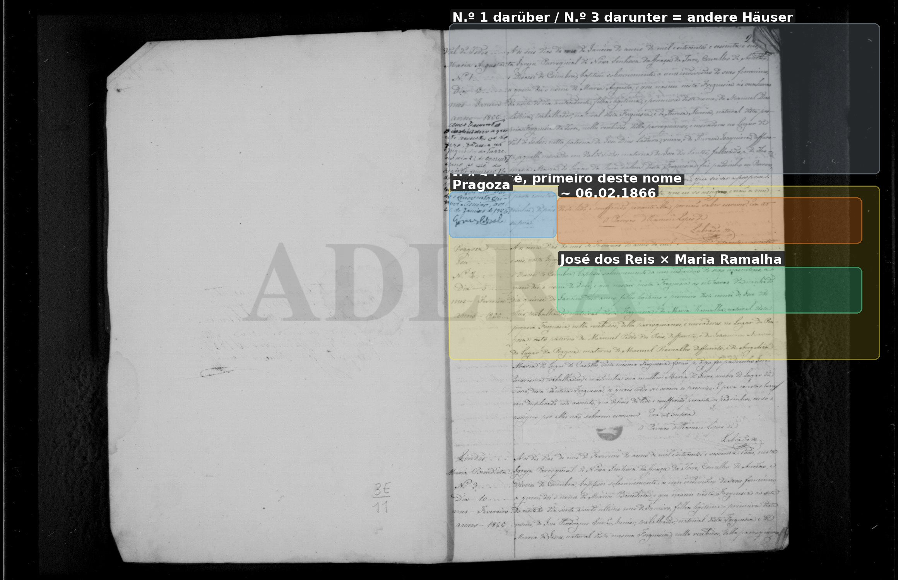
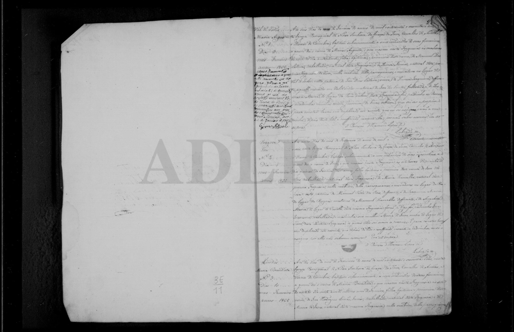

# José (primeiro, * 1866 Pragoza)

**Linie:** `matta` · **Gegenlese:** offen

| | |
| --- | --- |
| Quellenname | José |
| Rolle | erster Sohn José dos Reis × Maria Ramalha; Bruder Sebastião 1871 und Joaquina |
| * | Anfang Februar 1866 · Pragoza; ~ 06.02.1866 N.º 2 |
| † | offen (1875 gibt es einen **segundo deste nome** — Tod dieses ersten nicht gelesen) |
| Eltern / genannt mit | José dos Reis × Maria Ramalha |
| Gewissheit | Taufe **sicher**; **primeiro deste nome** |

Nicht José Pedro dos Reis (Kaufmann, anderes Haus). Nicht der José † 1896 (Kind Narciza).

## Scan

Markierung wie bei FamilySearch: **farbige Flächen = Fundstellen** (nicht die ganze Seite). Darunter der unveränderte Scan zur Gegenlese.

🟨 Name · 🟧 Datum · 🟦 Ort · 🟩 Eltern · 🟪 Avós · 🟥 Randvermerk · 🩵 Paten (nicht Elternort)

Scan ohne Markierung — Taufe 06.02.1866

Siehe auch:

- [José segundo 1875](../jose-1875/README.md)
- [Sebastião 1871](../sebastiao-1871/README.md)
