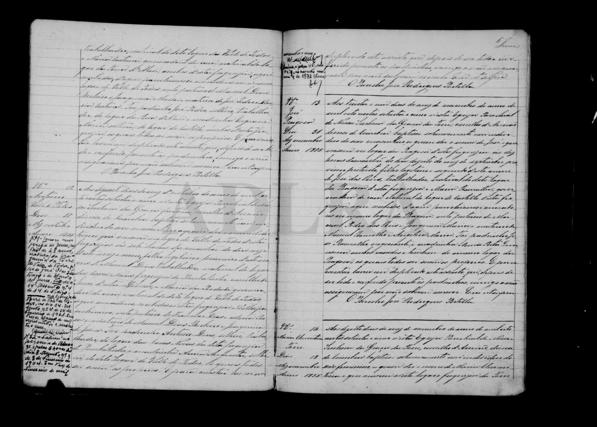

# José (segundo, * 1875 Pragoza)

**Linie:** `matta` · **Gegenlese:** offen

| | |
| --- | --- |
| Quellenname | José |
| Rolle | zweiter José dieses Paares; Bruder Sebastião und Joaquina |
| * | 18.09.1875, 10 Uhr · Pragoza; ~ 31.11.1875 (so der Priester; November hat 30 Tage) |
| † | offen |
| Eltern / genannt mit | José dos Reis, nat. Pragoza × Maria Ramalha, nat. **Castello** |
| Gewissheit | Taufe **sicher**; **segundo deste nome** |

Avós: Manuel Pedro dos Reis × Joaquina Maria; Manuel Ramalho × Angelica Maria.

## Scan

Markierung wie bei FamilySearch: **farbige Flächen = Fundstellen** (nicht die ganze Seite). Darunter der unveränderte Scan zur Gegenlese.

🟨 Name · 🟧 Datum · 🟦 Ort · 🟩 Eltern · 🟪 Avós · 🟥 Randvermerk · 🩵 Paten (nicht Elternort)

Scan ohne Markierung — Taufe 31.11.1875

Siehe auch:

- [José primeiro 1866](../jose-1866/README.md)
