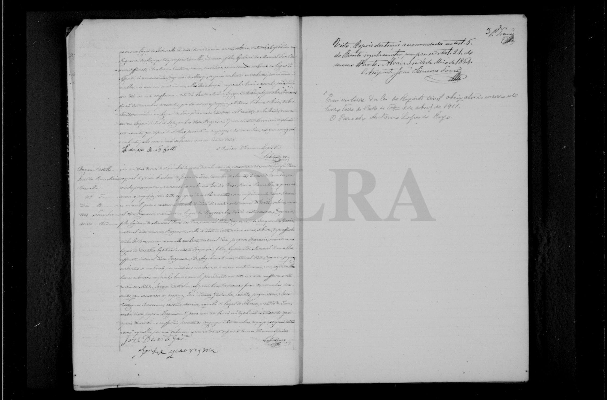
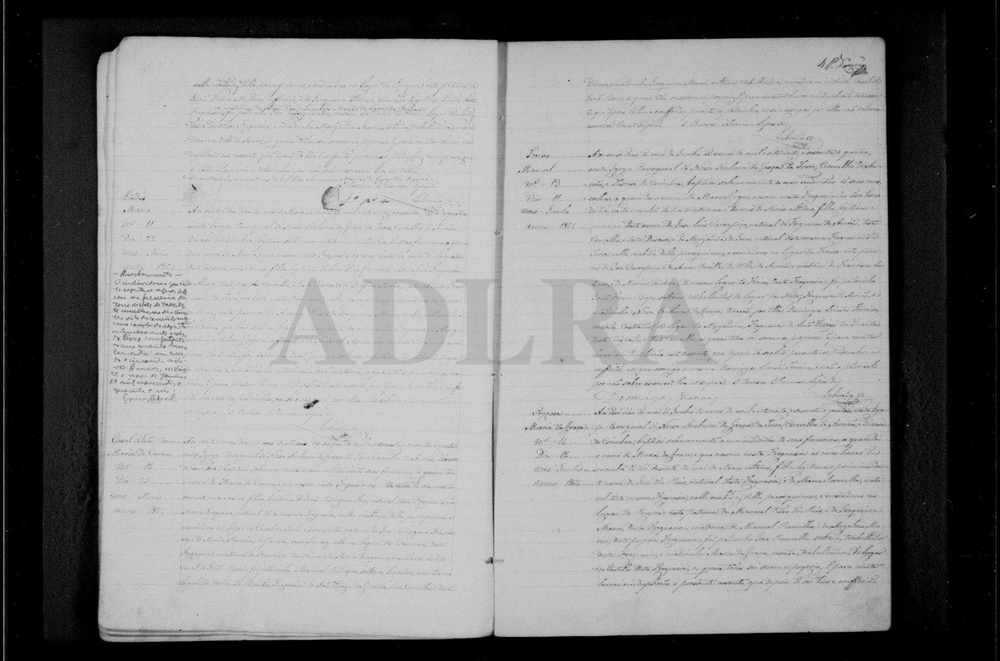
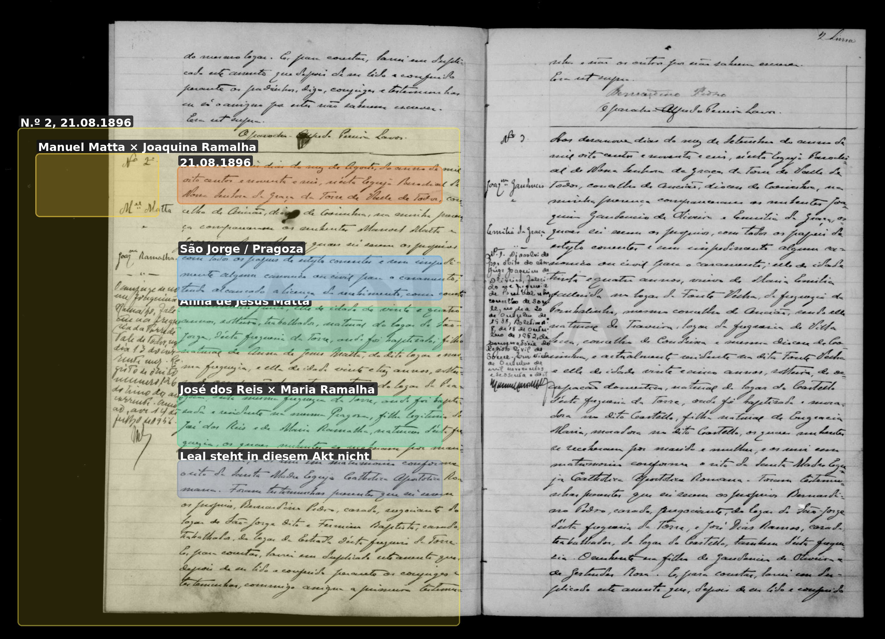

# José dos Reis (Pragoza, Ramalha-Haus)

**Linie:** `matta` · **Gegenlese:** offen

| | |
| --- | --- |
| Quellenname | José dos Reis |
| Rolle | 4.º avô Joaquinas; nicht José Pedro dos Reis (Kaufmann, anderes Haus) |
| * | ~1835 (28 am 16.11.1863) |
| † | tot vor 27.04.1912 |
| Eltern / genannt mit | Manoel Pedro dos Reis × Joaquina Maria |
| Gewissheit | Heirat 16.11.1863 **sicher**; Vater der Kinder 1866–1896 sicher |

Eigene Heirat hier. Die zwei Reis-Häuser nicht mischen. Kinder gelesen: **Maria da Graça * 30.05.1864** (primeira do nome); José 1866 (primeiro); Maria 1867; Sebastião 1871 (primeiro nach dem Wortlaut 1871 — daneben schon José 1866); José 1875 (segundo deste nome). **Joaquina 1875–80 nicht** in Torre. 1864–1865 ganz gelesen.

Ausführlich: [zwei Reis-Häuser](../../../evidenz/linie-torre/zwei-reis-haeuser-pragoza.md).

## Scan

Markierung wie bei FamilySearch: **farbige Flächen = Fundstellen** (nicht die ganze Seite). Darunter der unveränderte Scan zur Gegenlese.

🟨 Name · 🟧 Datum · 🟦 Ort · 🟩 Eltern · 🟪 Avós · 🟥 Randvermerk · 🩵 Paten (nicht Elternort)

Zum späteren Gegenlesen. Nicht neu datieren, nur die Handschrift halten.

Scan ohne Markierung — Taufe Sohn Sebastião 1871

Scan ohne Markierung — Heirat Tochter Joaquina 1896

Siehe auch:

- [José Pedro dos Reis](../../narcisa/jose-pedro-dos-reis/README.md)
