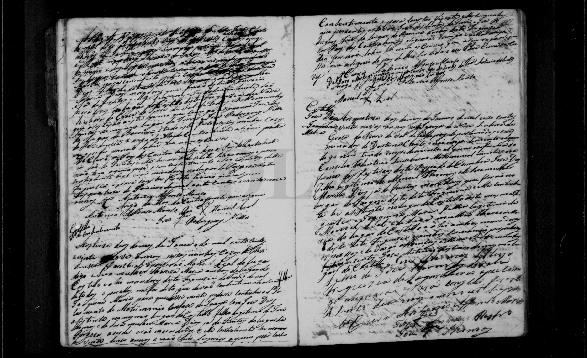
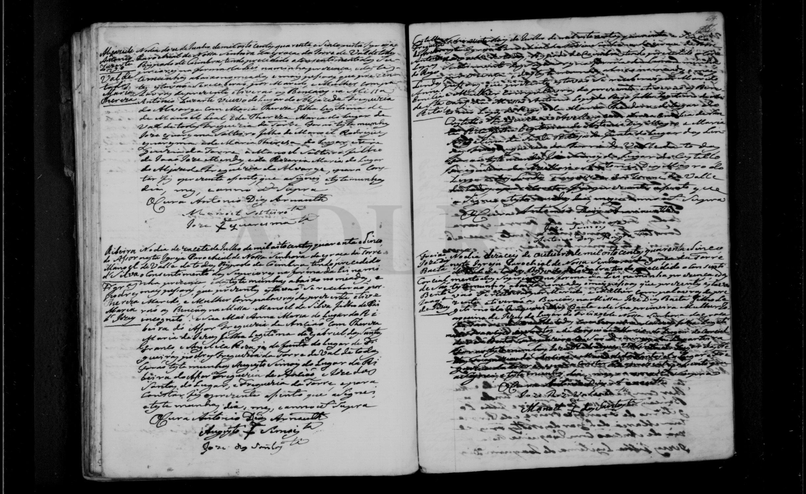

# Manoel Leal × Thereza Maria

**Linie:** `matta` · **Gegenlese:** offen

| | |
| --- | --- |
| Quellenname | Manoel Leal × Thereza Maria |
| Rolle | Eltern der Angelica (Heirat 1838); avós maternos José 1841/1843 |
| * / † | offen. Eigene Heirat **nicht** in Torre Casamentos 1812–1825 |
| Wohnen | **Castello** (1815, 1829, 1838, 1841); 1846 Vale de Todos; 1843 Freixo genannt |
| Gewissheit | Paar **sicher** als Eltern in den Kinder-Akten |

Eigene Trauung vor 1812 oder in `PANS08/002/0003` nicht gefunden
(Band beginnt 1812; 1815 sind sie schon Eltern). Nächstes Buch
online: `PANS08/002/0002` = dieselben TIFFs wie die Taufen, nicht
die physischen Casamentos 1719–1813.

Tochter **Angelica** getauft **06.04.1815** Castello
(`PANS08/001/0003` m0015). Avós dort: **Manoel José** × **Roza
Maria**, Vale de Todos; **José [João?] Casimiro** × **Anna Maria**,
Castello. Scan bei [angelica-maria](../angelica-maria/README.md).

Töchter in Torre-Heiraten (nicht Angelicas Kinder):

| Kind | Akt | Gewissheit |
| --- | --- | --- |
| Joaquina Maria × Jose Dias, Castello | 14.01.1829 | sicher |
| Angelica Maria × Manoel Ramalho | * ~28.03.1815 / ~ 06.04.1815; Feb. 1838 (21. oder 22.) | Taufe **sicher** (dieses Paar). Heirat: Datum Gegenlese; Identität avós **Kandidat** |
| Maria Thereza × Antonio Levante Freire (Alvorge) | 02.06.1846 | sicher |

Alvorge-Anschluss über **Maria Thereza**, nicht über Marias Taufe 1842
(Alvorge 1839–43 ohne Maria von Ramalho × Angelica).

**Prüfen:** [ramalha-pruefung](../../../evidenz/linie-torre/ramalha-pruefung.md).

## Scan

🟨 Name · 🟧 Datum · 🟦 Ort · 🟩 Eltern · 🟪 Avós · 🟥 Randvermerk · 🩵 Paten

Scan ohne Markierung — 1829

Scan ohne Markierung — 1846

