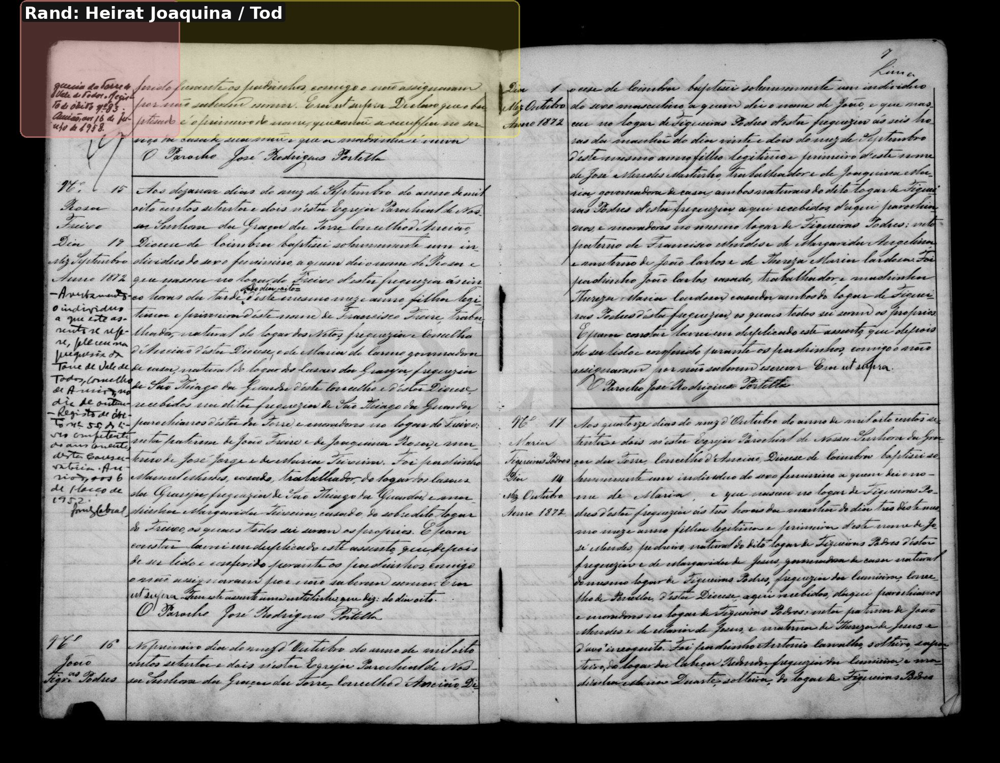

# Manuel Matta

**Linie:** `matta` · **Gegenlese:** offen

| | |
| --- | --- |
| Quellenname | Manuel (Matta bei der Mutter 1872) |
| Rolle | 3.º avô, ramo materno |
| * | 26.07.1872 · São Jorge; ~ 01.08.1872 Torre N.º 14 |
| † | Blatt 15.02.1946; Rand: Tod am 15., Nachtrag 14.07.1946 Ansião N.º 126 |
| Eltern / genannt mit | Pai incógnito × Anna de Jesus Matta |
| Gewissheit | Geburt sicher; Tod Richtung Blatt, Sterbeakt nicht geprüft |

Eigene Taufe und Heirat 21.08.1896 hier. Zivil 1912 schreibt 26.08.1897 — Kirche geht vor. 1912 wohnhaft Pragoza.

Ausführlich: [joaquina-reis-leal](../../../evidenz/linie-torre/joaquina-reis-leal.md).

## Scan

Markierung wie bei FamilySearch: **farbige Flächen = Fundstellen** (nicht die ganze Seite). Darunter der unveränderte Scan zur Gegenlese.

🟨 Name · 🟧 Datum · 🟦 Ort · 🟩 Eltern · 🟪 Avós · 🟥 Randvermerk · 🩵 Paten (nicht Elternort)

Zum späteren Gegenlesen. Nicht neu datieren, nur die Handschrift halten.

Scan ohne Markierung — Taufe 01.08.1872

Scan ohne Markierung — Taufe, Folgeseite

Scan ohne Markierung — Heirat 21.08.1896

Scan ohne Markierung — Taufe erste Tochter Palmyra 1897

Scan ohne Markierung — Taufe Sohn Casimiro 1898

Siehe auch:

- [Joaquina Ramalha](../joaquina-ramalha/README.md)
- [Casimiro 1898](../casimiro-1898/README.md)
