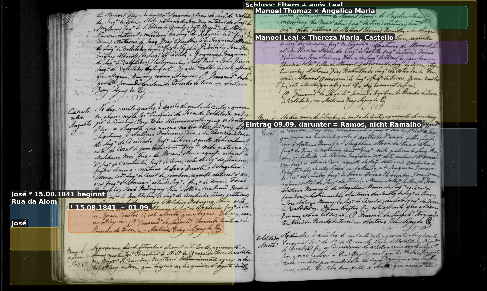
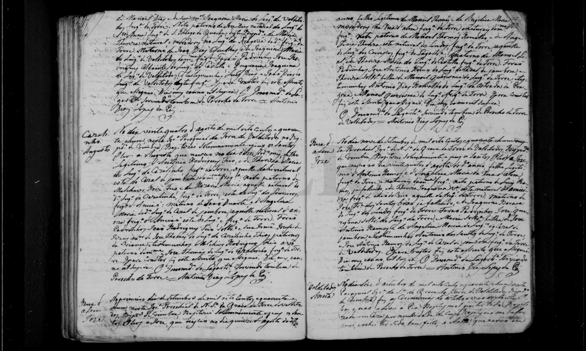
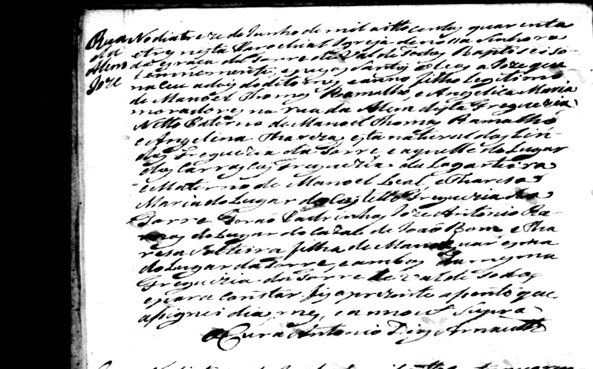
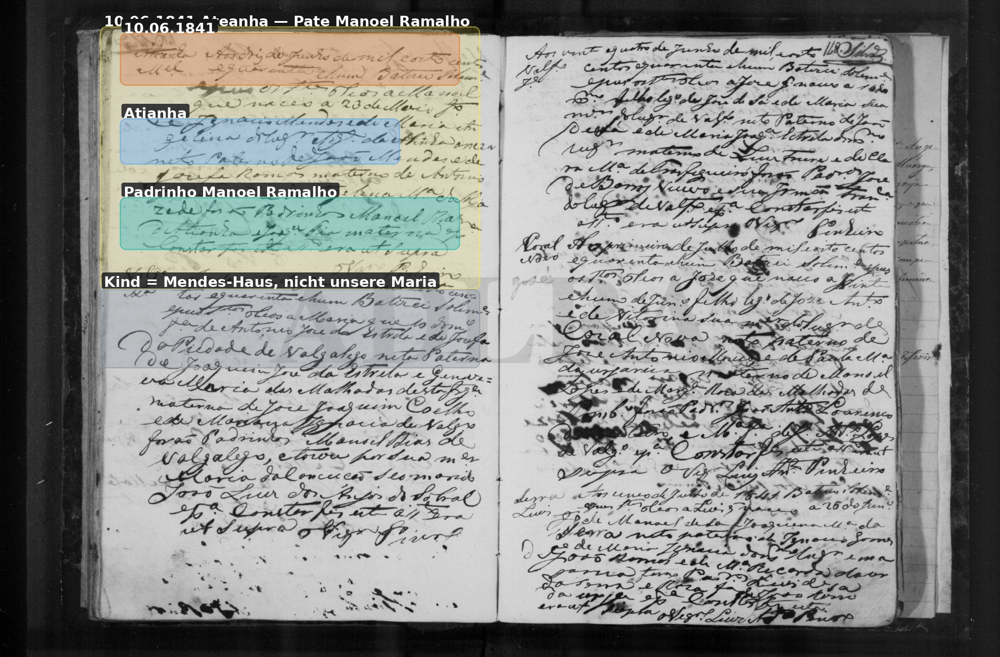
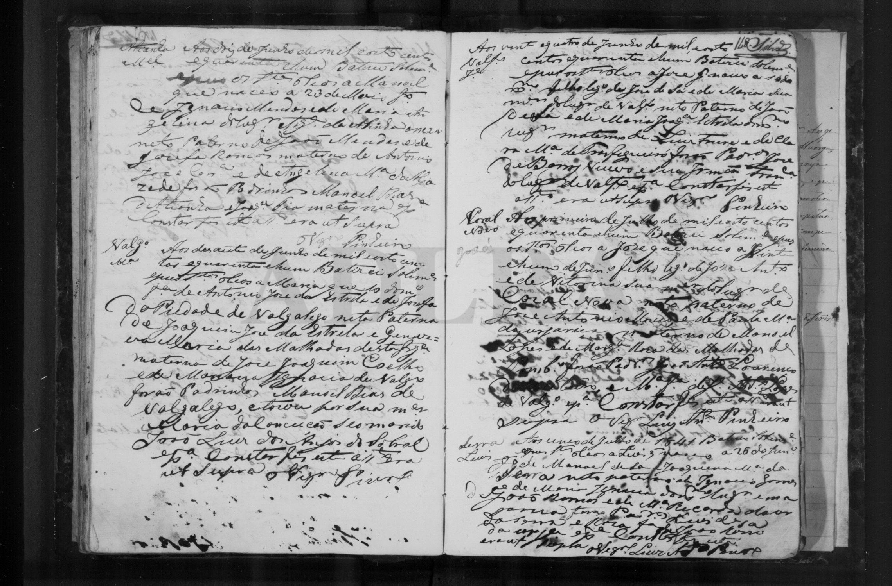

# Manuel Ramalho

**Linie:** `matta` · **Gegenlese:** offen

| | |
| --- | --- |
| Quellenname | **Manuel Dias Ramalho** (Blatt); Kirche Torre 1871 nur Manuel Ramalho |
| Rolle | avô materno Sebastião 1871; Blatt setzt ihn als 4.º Joaquinas — eine Generation zu hoch |
| * | offen — Herkunft der Sippe **Ateanha** (Auftraggeber, Kandidat) |
| † | tot vor 16.11.1863 (1863 `defunto`) |
| Gewissheit | **Dias Ramalho** Blatt. Kirche: Manoel Ramalho / 1843 **Thomaz** |

**Dias** nicht streichen. 1838 und 1843 schreiben Dias **nicht**.
Nicht Dias Guiomar, nicht Dias Barbeiro.

Heirat **21.02.1838** Torre: **Manoel Ramalho** × Angelica M., sie
Tochter **Manoel Leal**. Castello / Pregoza. **Kandidat** dasselbe
Paar wie avós 1863/1871. Scan zum Prüfen.

Söhne José: * **15.08.1841** (primeiro, Rua da Alom) und
* **02.06.1843** (Kandidat segundo; Pate 1864 eher dieser).

Alvorge 10.06.1841: **Manoel Ramalho** Pate bei einem Mendes-Kind in
**Atianha**. Identität **Kandidat**. Nicht das Mendes-Haus anhängen.

Palmira jetzt nicht. Geschwister Joaquinas nicht noch einmal suchen.

**Prüfen:** [ramalha-pruefung](../../../evidenz/linie-torre/ramalha-pruefung.md)
(Scans + Frage). Lesung: [ramalha-ateanha-1873](../../../evidenz/linie-torre/ramalha-ateanha-1873.md).

## Scan

Markierung wie bei FamilySearch: **farbige Flächen = Fundstellen** (nicht die ganze Seite). Darunter der unveränderte Scan zur Gegenlese.

🟨 Name · 🟧 Datum · 🟦 Ort · 🟩 Eltern · 🟪 Avós · 🟥 Randvermerk · 🩵 Paten (nicht Elternort)

Zum späteren Gegenlesen. Nicht neu datieren, nur die Handschrift halten.

Scan ohne Markierung — Taufe Enkel Sebastião 1871

Scan ohne Markierung — Heirat 21.02.1838

Ausschnitt rechte Seite (Kontrast, zum Prüfen):

Scan ohne Markierung — José * 15.08.1841

Scan ohne Markierung — Taufe Sohn José 02.06.1843 (Kandidat)

Ausschnitt (Kontrast):

Scan ohne Markierung — Pate Ateanha 10.06.1841

