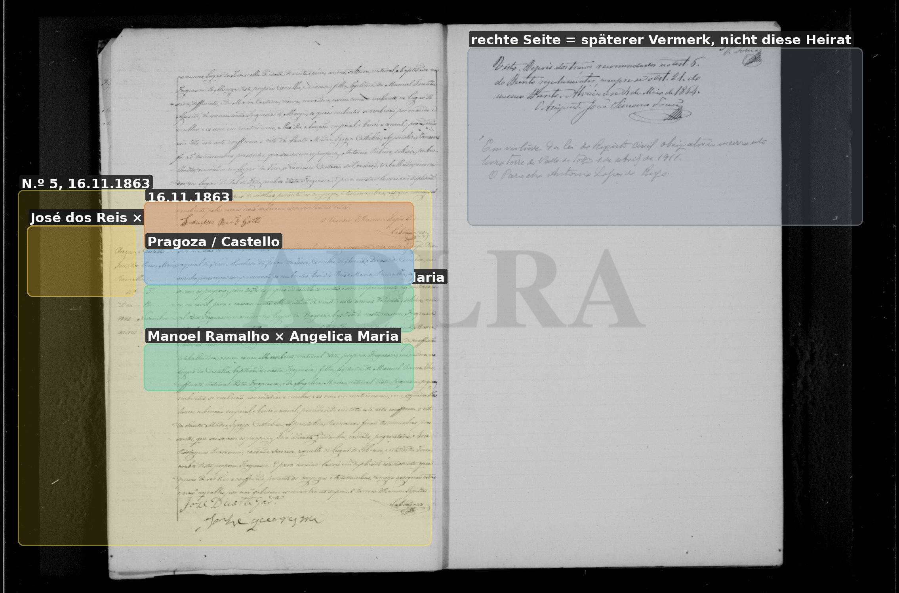
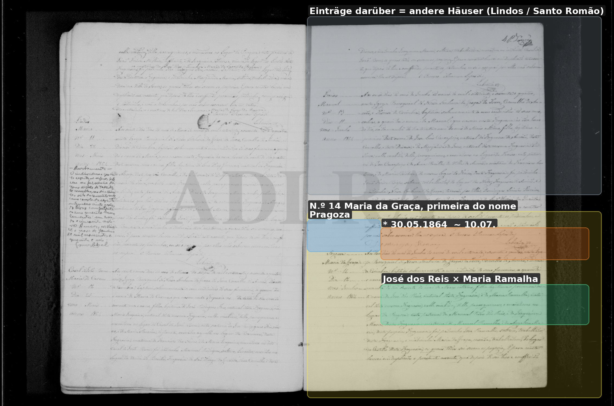
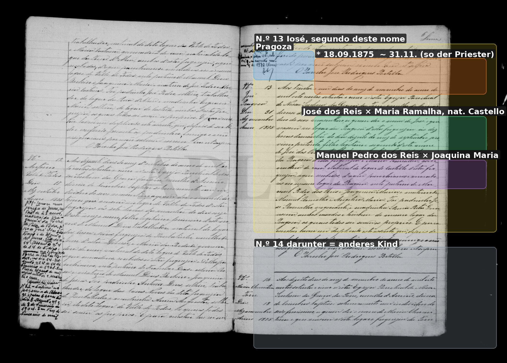
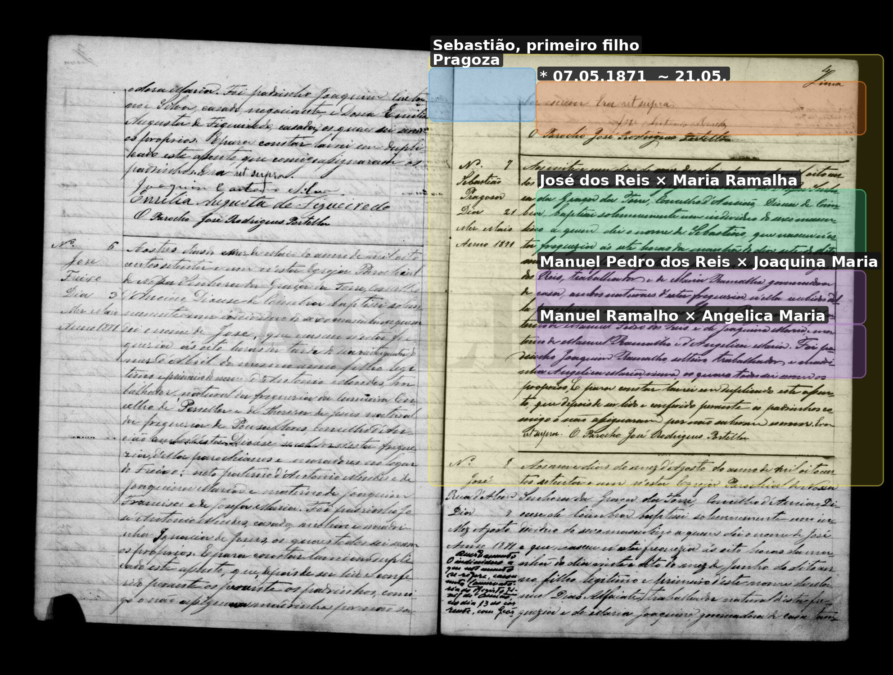

# Maria Ramalha

**Linie:** `matta` · **Gegenlese:** offen

| | |
| --- | --- |
| Quellenname | Maria Ramalha |
| Rolle | 4.º avó Joaquinas |
| * | ~1842 (21 am 16.11.1863). Herkunft der Sippe **nicht Torre** (Auftraggeber) |
| † | offen |
| Eltern / genannt mit | Manoel Ramalho, defunto × Angelica Maria. Blatt: **Manuel Dias Ramalho** × Angelica Maria Leal |
| Gewissheit | Heirat **16.11.1863 in Torre** sicher. Das ist Wohnort/Trauort, nicht die Herkunft |

1863: Castello. 1864 schreibt der Torre-Priester `natural desta freguesia`
(sie wohnt schon Pragoza). 1875 wieder nat. **Castello**. Naturalidade ≠
Herkunft der Ramalha. Auftraggeber: Sippe **Ateanha** — **Kandidat**.
Castello der Akte = Flecken in Vale de Todos, nicht Ateanha, nicht
Avelar. **Dias** / **Leal** stehen auf dem Blatt, in den Torre-Akten
1863/1871 nicht.

Heirat gefunden. Kinder in Torre/Pragoza getauft — **haben wir**.
Tochter **Joaquina * 15.06.1873** — Blatt. Alvorge Juni 1873 ohne
ihren Kirchenakt.

1841: **Manoel Ramalho** Pate in Atianha (Mendes-Kind) — Kandidat
derselbe Mann. Eigene Taufe Maria ~1842 noch nicht festgelesen
(`m0159` blass). Palmira jetzt nicht.

[ramalha-ateanha-1873](../../../evidenz/linie-torre/ramalha-ateanha-1873.md).

## Scan

Markierung wie bei FamilySearch: **farbige Flächen = Fundstellen** (nicht die ganze Seite). Darunter der unveränderte Scan zur Gegenlese.

🟨 Name · 🟧 Datum · 🟦 Ort · 🟩 Eltern · 🟪 Avós · 🟥 Randvermerk · 🩵 Paten (nicht Elternort)

Zum späteren Gegenlesen. Nicht neu datieren, nur die Handschrift halten.

Scan ohne Markierung — Heirat 16.11.1863

Scan ohne Markierung — Taufe Tochter Maria da Graça 10.07.1864

Scan ohne Markierung — Taufe Sohn José 1866

Scan ohne Markierung — Taufe Sohn José 1875

Scan ohne Markierung — Taufe Sohn Sebastião 1871

Scan ohne Markierung — Heirat Tochter Joaquina 1896

