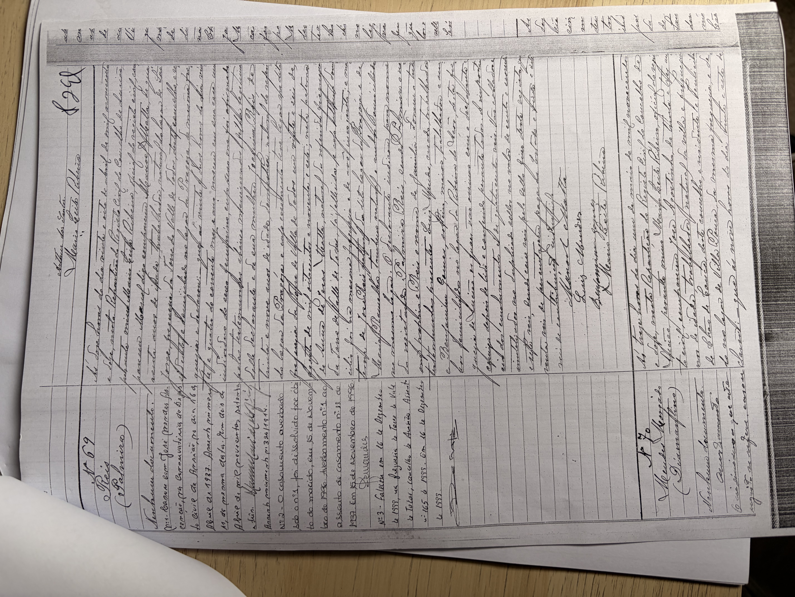

# Palmira Reis (* 1912)

**Linie:** `matta` · **Gegenlese:** offen

| | |
| --- | --- |
| Quellenname | Palmira dos Reis / Palmira Reis |
| Rolle | bisavó, ramo materno |
| * | 24.04.1912 · Pragoza |
| † | 16.12.1999 · Torre (Averbamento Assento 165/1999) |
| Eltern / genannt mit | Manuel Matta × Joaquina Reis |
| Gewissheit | Geburt und Tod sicher (Zivil `08.jpg` / Averbamento) |

Viel später als Palmyra * 08.06.1897. Fotos in Conservatória, nicht kopiert.

Ausführlich: [joaquina-reis-leal](../../../evidenz/linie-torre/joaquina-reis-leal.md).

## Scan

Zum späteren Gegenlesen. Nicht neu datieren, nur die Handschrift halten.

Geburt 24.04.1912 — liegt in der Conservatória, nicht hierher kopiert:

Geburt, Folgeseite — liegt in der Conservatória, nicht hierher kopiert:

Heirat 19.04.1937 — liegt in der Conservatória, nicht hierher kopiert:

Heirat, Schluss — liegt in der Conservatória, nicht hierher kopiert:

Siehe auch:

- [Palmyra 1897](../palmyra-1897/README.md)
