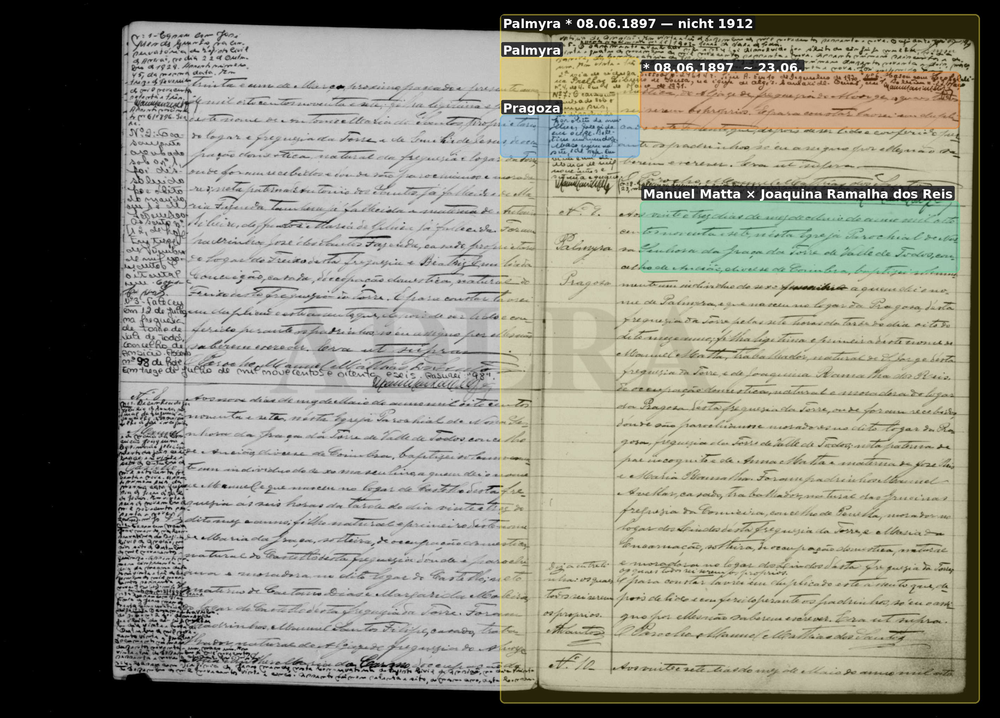
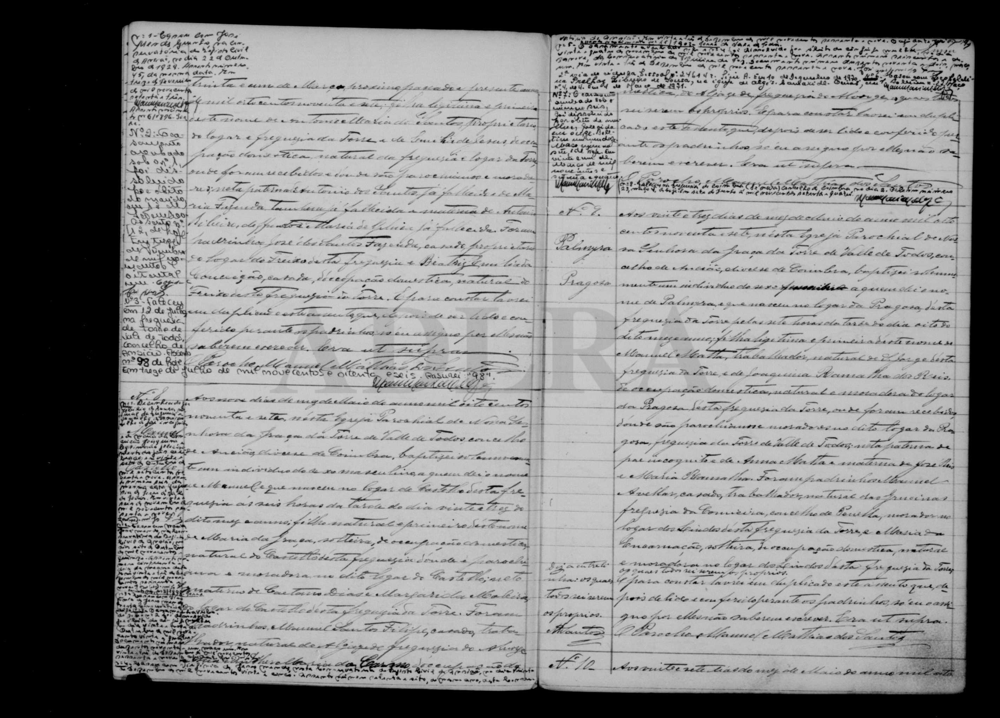

# Palmyra (* 1897, erste Tochter)

**Linie:** `matta` · **Gegenlese:** offen

| | |
| --- | --- |
| Quellenname | Palmyra |
| Rolle | primeira filha Manuel × Joaquina Ramalha — nicht die Blatt-Palmira 1912 |
| * | 08.06.1897 · Pragoza; ~ 23.06.1897 Torre N.º 9 |
| † | offen (Namenswiederholung 1912: Tod dieser Palmyra ist Kandidat) |
| Eltern / genannt mit | Manuel Matta × Joaquina Ramalha dos Reis |
| Gewissheit | Taufe sicher; Sterbeakt offen |

Nicht mit Palmira Reis * 24.04.1912 zusammenziehen.

Ausführlich: [joaquina-reis-leal](../../../evidenz/linie-torre/joaquina-reis-leal.md).

## Scan

Markierung wie bei FamilySearch: **farbige Flächen = Fundstellen** (nicht die ganze Seite). Darunter der unveränderte Scan zur Gegenlese.

🟨 Name · 🟧 Datum · 🟦 Ort · 🟩 Eltern · 🟪 Avós · 🟥 Randvermerk · 🩵 Paten (nicht Elternort)

Zum späteren Gegenlesen. Nicht neu datieren, nur die Handschrift halten.

Scan ohne Markierung — Taufe 23.06.1897

Siehe auch:

- [Palmira 1912](../palmira-reis-1912/README.md)
