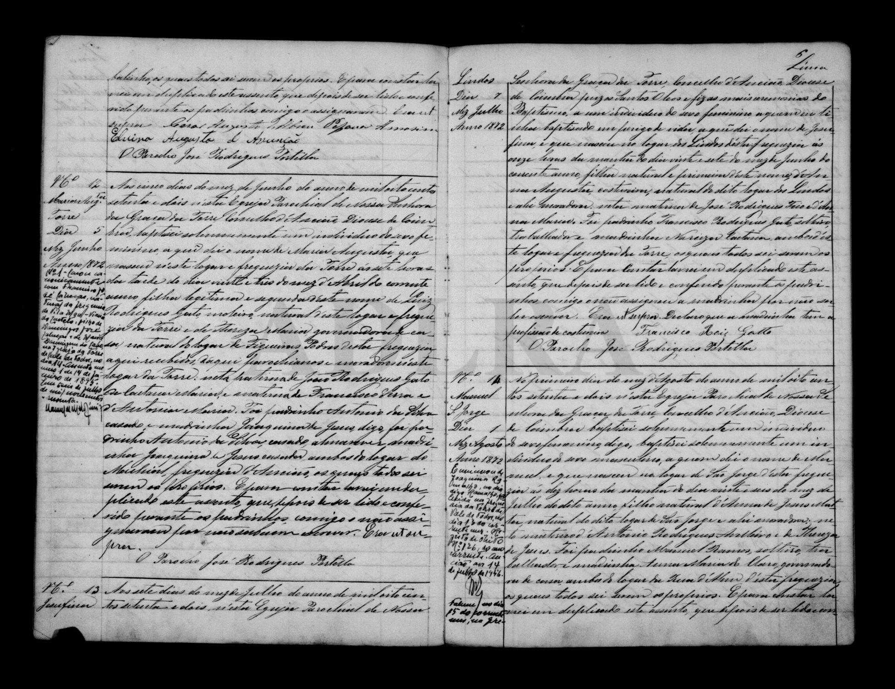

# Thereza de Jesus

**Linie:** `matta` · **Gegenlese:** offen

| | |
| --- | --- |
| Quellenname | Thereza de Jesus |
| Rolle | 5.º avó; avó Manuel Matta 1872 |
| * | offen |
| † | offen |
| Gewissheit | sicher genannt 1872 |

Kein eigener Akt.

## Scan

Zum späteren Gegenlesen. Nicht neu datieren, nur die Handschrift halten.

