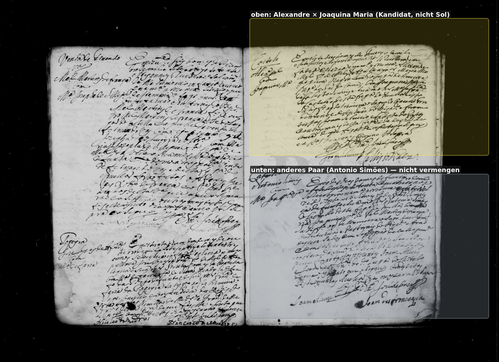
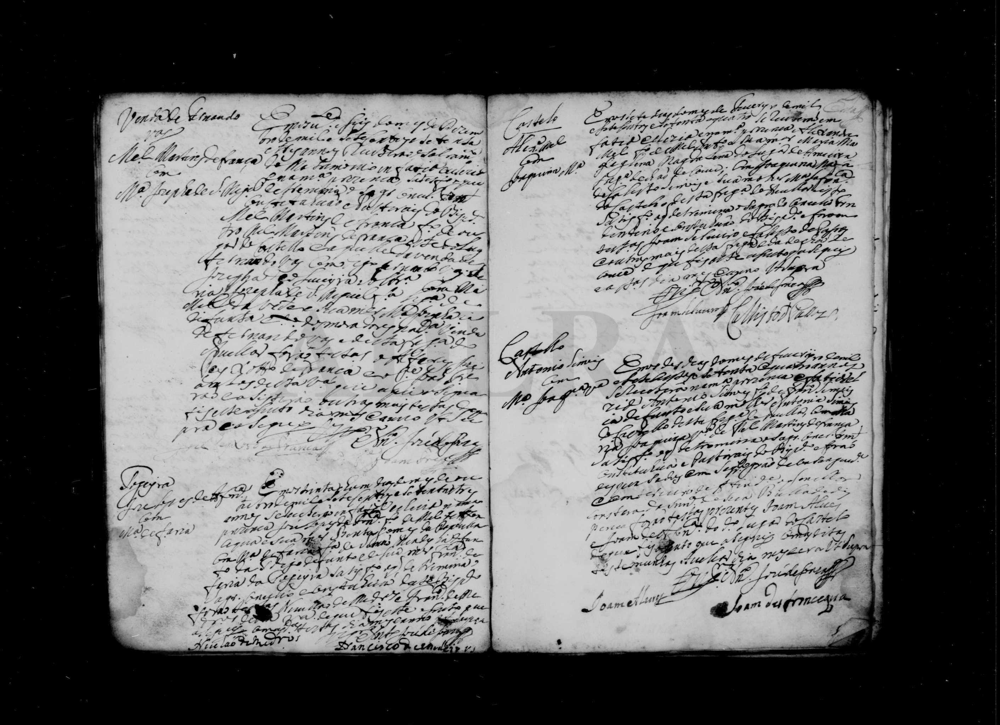

# Avelar 1774 — abgrenzen, nicht Sol

**Linie:** `narcisa` · **Gegenlese:** offen

| | |
| --- | --- |
| Quellenname | Alexandre × Joaquina Maria (oben) und Antonio Simões × M.a Joaquina (unten) |
| Rolle | Kandidatenblatt; nicht still = Caetanas Großeltern |
| * | oberer Eintrag: Tag 7, bessere Lesung 7. Februar 1774 |
| † | — |
| Gewissheit | wahrscheinlich Kandidat für Alexandre Manoel × Joaquina da Affonseca; nicht gesichert. Unteres Paar ist ein anderes. |

**Nicht** in die Sol-Linie übernehmen. Castello = Pfarrei Avelar, nicht Castello Vale de Todos. Theodora Maria 1781 ist nicht Maria Joaquina Sol. Furtado/Affonseca aus diesem Rand nicht als Fakt.

Ausführlich: [avelar-kandidaten](../../../evidenz/linie-torre/avelar-kandidaten.md).

## Scan

Markierung wie bei FamilySearch: **farbige Flächen = Fundstellen** (nicht die ganze Seite). Darunter der unveränderte Scan zur Gegenlese.

🟨 Name · 🟧 Datum · 🟦 Ort · 🟩 Eltern · 🟪 Avós · 🟥 Randvermerk · 🩵 Paten (nicht Elternort)

Zum späteren Gegenlesen. Nicht neu datieren, nur die Handschrift halten.

Scan ohne Markierung — Zwei Heiraten, rechte Seite m0013

