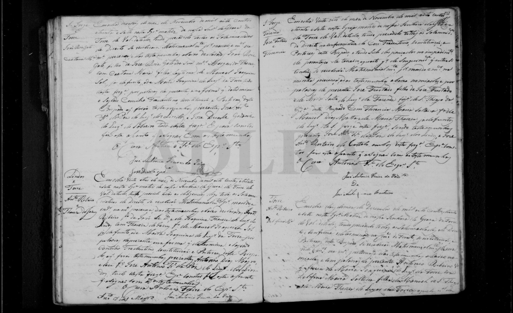
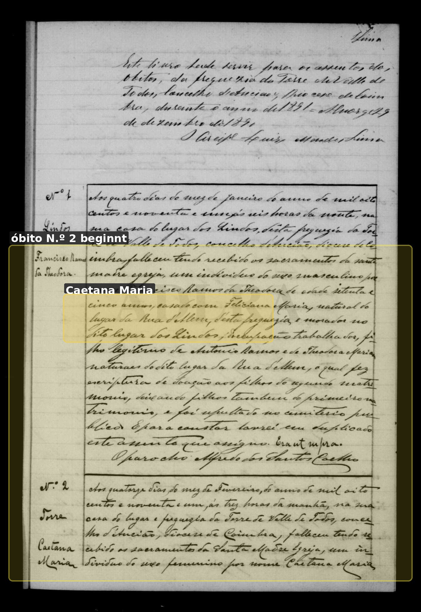
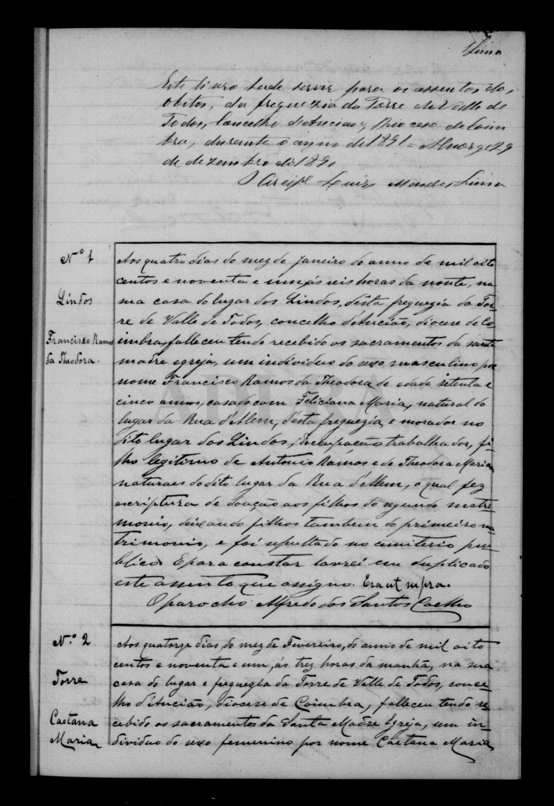
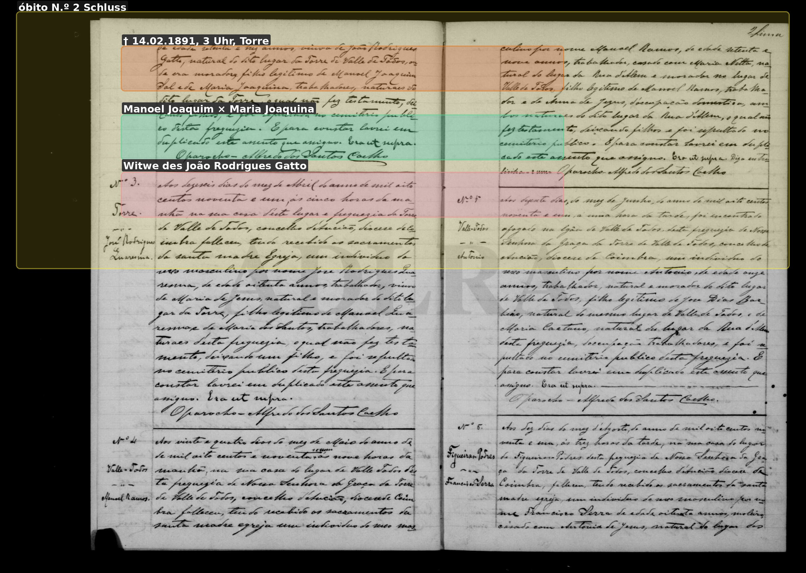
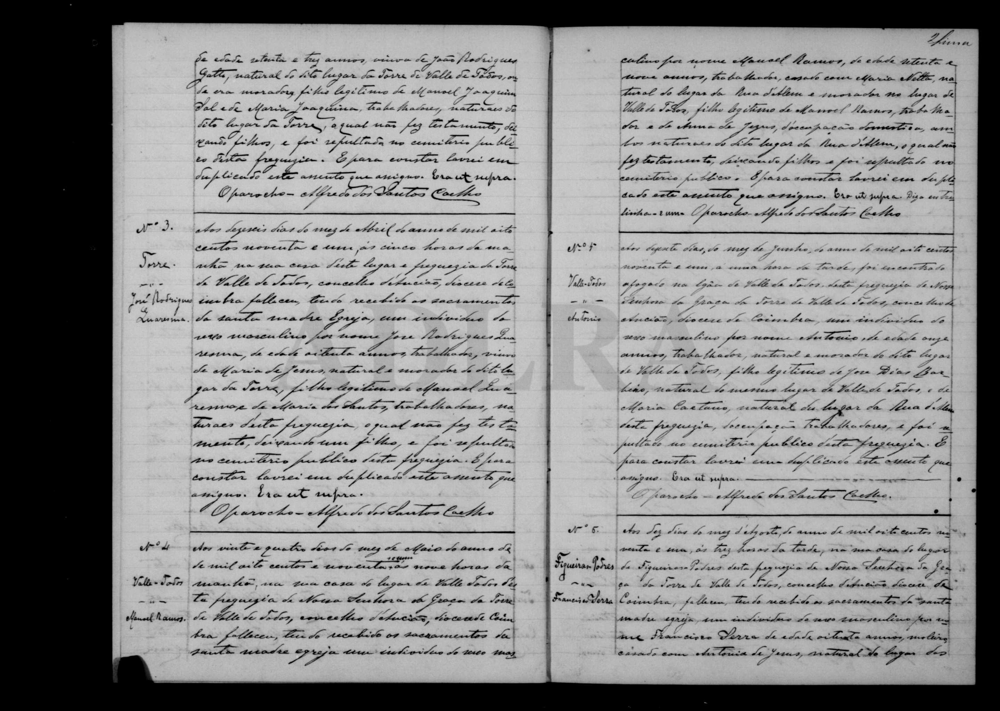

# Caetana Maria

**Linie:** `narcisa` · **Gegenlese:** offen

| | |
| --- | --- |
| Quellenname | Caetana Maria (nicht Catharina; späteres Catarina = Lesart) |
| Rolle | 5.º avó; Mutter Narciza |
| * | rechnerisch 13.11.1815 (8 Tage alt am 21.11.1815); Kalendertag nicht ausgeschrieben |
| † | 14.02.1891 · Torre, 3 Uhr; Alter 73 weicht um ca. 2 Jahre |
| Eltern / genannt mit | Manoel Joaquim Sol × Maria Joaquina |
| Gewissheit | Taufe, Heirat 16.11.1837, Tod sicher als Identität |

Eigene drei Akte hier. Heirat: Bräutigam João Roiz Gato; Vater des Bräutigams wahrscheinlich José Roiz Gato vs. Narcizas Taufe João Rodrigues Gato — Abweichung nicht wegkorrigieren.

Ausführlich: [caetana-maria](../../../evidenz/linie-torre/caetana-maria.md).

## Scan

Markierung wie bei FamilySearch: **farbige Flächen = Fundstellen** (nicht die ganze Seite). Darunter der unveränderte Scan zur Gegenlese.

🟨 Name · 🟧 Datum · 🟦 Ort · 🟩 Eltern · 🟪 Avós · 🟥 Randvermerk · 🩵 Paten (nicht Elternort)

Zum späteren Gegenlesen. Nicht neu datieren, nur die Handschrift halten.

Scan ohne Markierung — Taufe 21.11.1815

Scan ohne Markierung — Heirat 16.11.1837

Scan ohne Markierung — Óbito Beginn 1891

Scan ohne Markierung — Óbito Schluss 1891

Siehe auch:

- [Avelar abgrenzen](../_abgrenzen-avelar/README.md)
