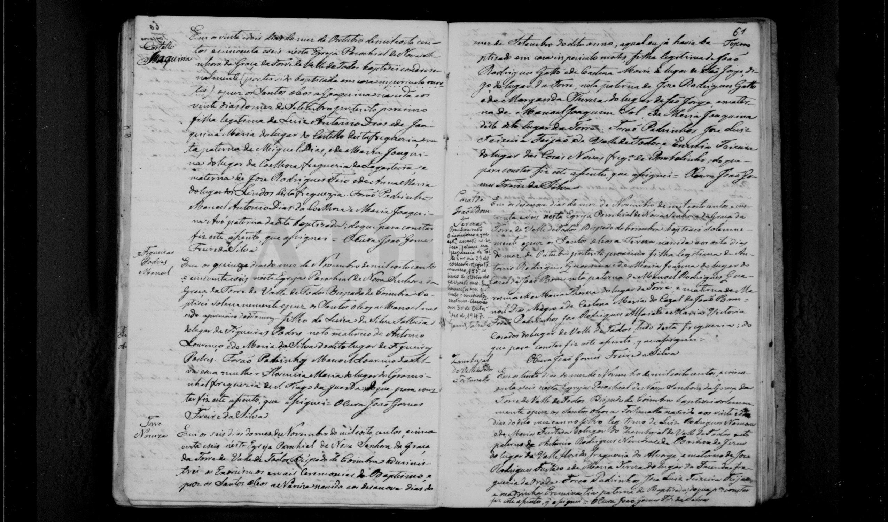

# João Rodrigues Gato

**Linie:** `narcisa` · **Gegenlese:** offen

| | |
| --- | --- |
| Quellenname | João Roiz Gato / João Rodrigues Gato / Gatto (1891) |
| Rolle | 5.º avô; São Jorge (Kapelle Vale de Todos) |
| * | offen |
| † | vor 14.02.1891 (Caetana Witwe) |
| Eltern / genannt mit | Mutter Margarida Thereza (1837); Vater wahrscheinlich José Roiz Gato |
| Gewissheit | Heirat 1837 sehr wahrscheinlich = Narcizas Eltern; dokumentarische Abweichung Gato-Vater nicht glätten |

Kein eigener Taufakt. Heirat bei Caetana physisch, Kopie hier.

Ausführlich: [caetana-maria](../../../evidenz/linie-torre/caetana-maria.md).

## Scan

Zum späteren Gegenlesen. Nicht neu datieren, nur die Handschrift halten.

