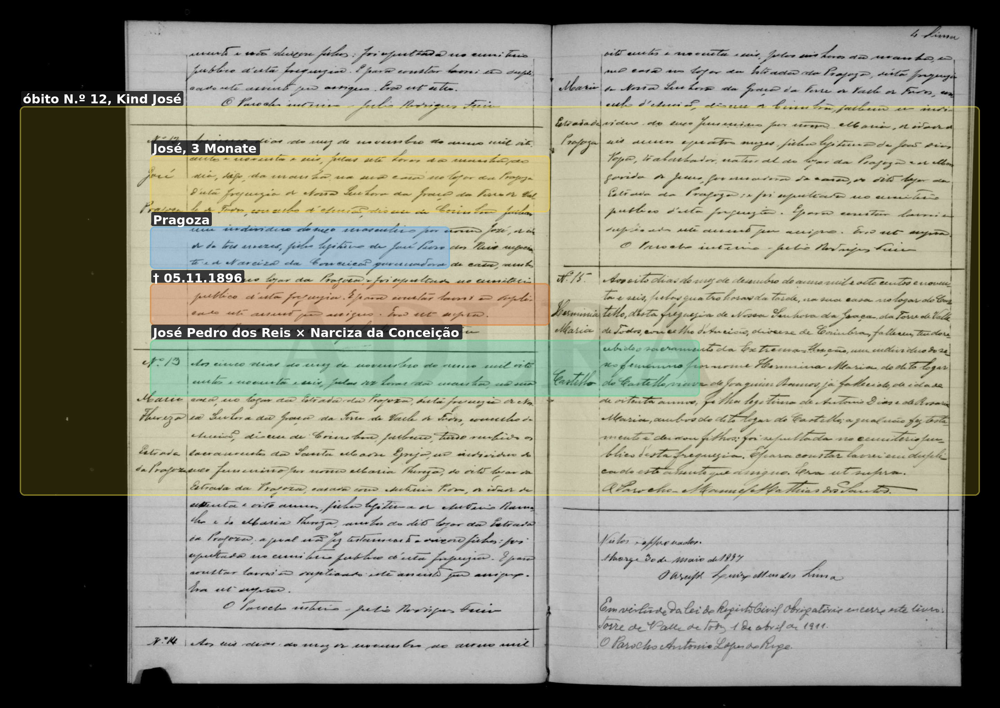
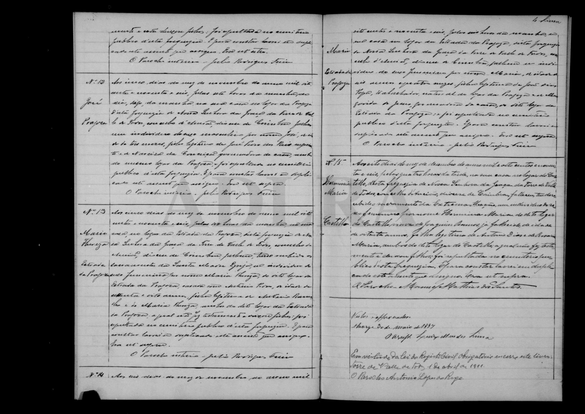

# José (Kind, † 1896)

**Linie:** `narcisa` · **Gegenlese:** offen

| | |
| --- | --- |
| Quellenname | José |
| Rolle | Sohn José Pedro × Narciza; drei Monate alt |
| * | ca. August 1896 · Pragoza (3 Monate am 05.11.1896) |
| † | 05.11.1896 · Pragoza |
| Eltern / genannt mit | José Pedro dos Reis × Narciza da Conceição |
| Gewissheit | óbito sicher |

Eigener Sterbeakt. Nicht José Pedro der Vater und nicht José Mendes.

## Scan

Markierung wie bei FamilySearch: **farbige Flächen = Fundstellen** (nicht die ganze Seite). Darunter der unveränderte Scan zur Gegenlese.

🟨 Name · 🟧 Datum · 🟦 Ort · 🟩 Eltern · 🟪 Avós · 🟥 Randvermerk · 🩵 Paten (nicht Elternort)

Zum späteren Gegenlesen. Nicht neu datieren, nur die Handschrift halten.

Scan ohne Markierung — Óbito N.º 12, 05.11.1896

