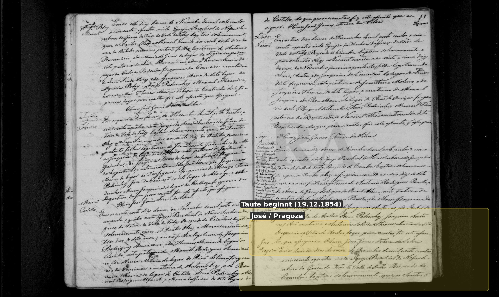
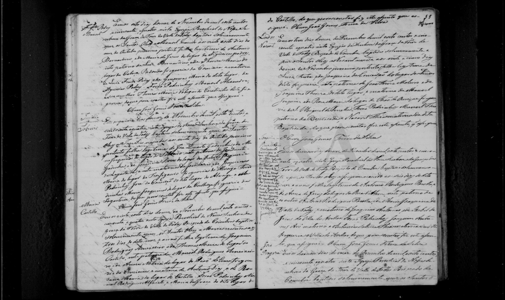
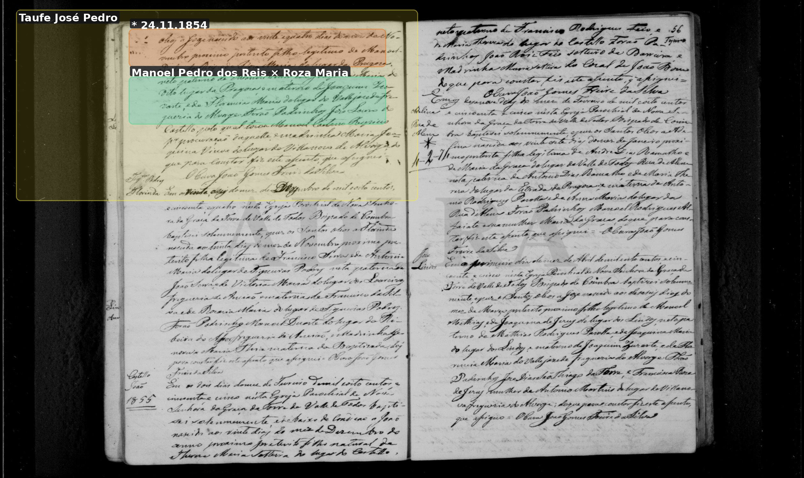
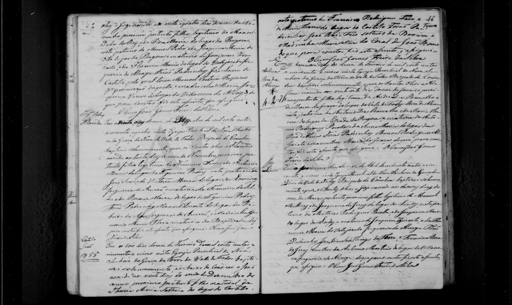
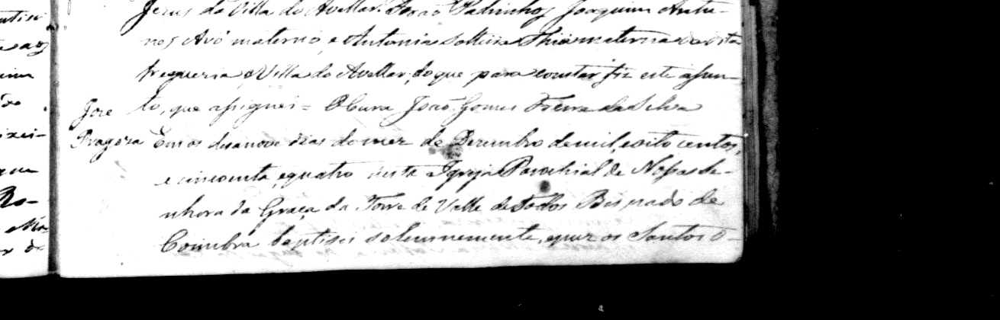
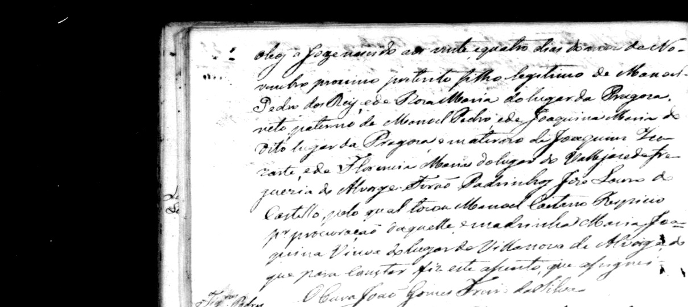
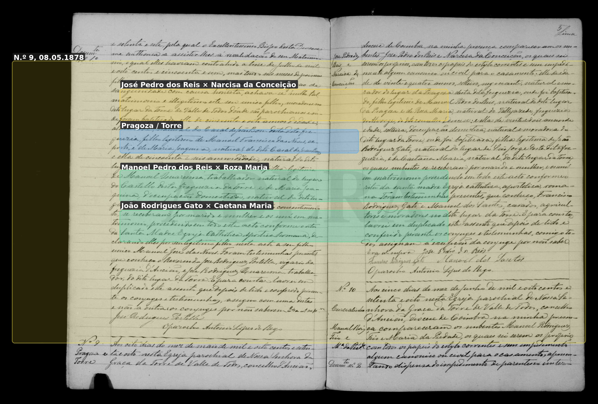
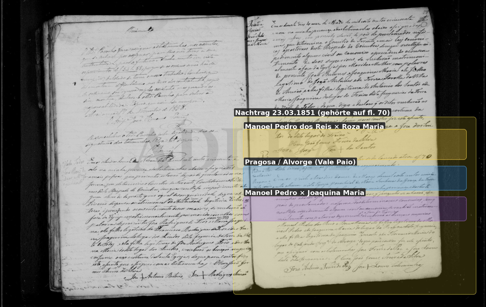
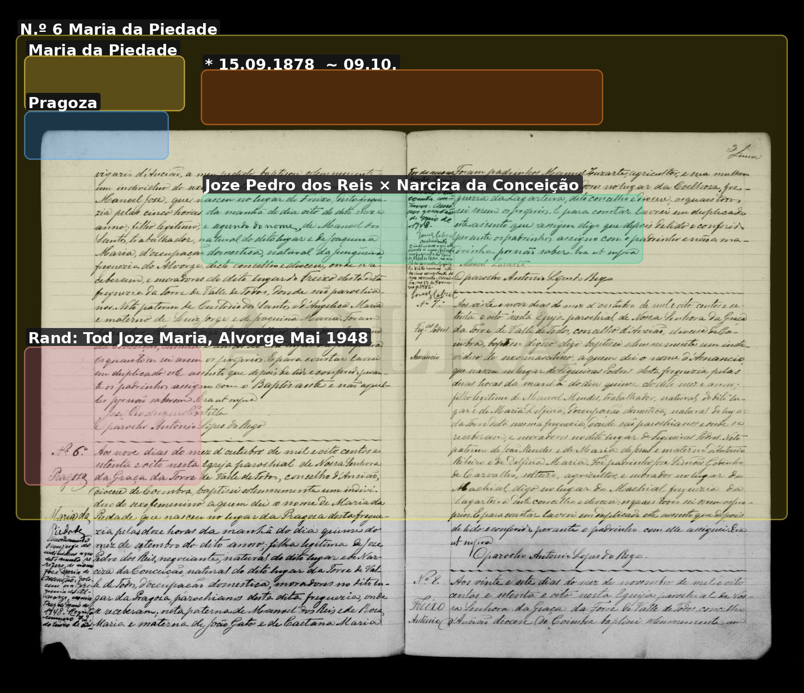
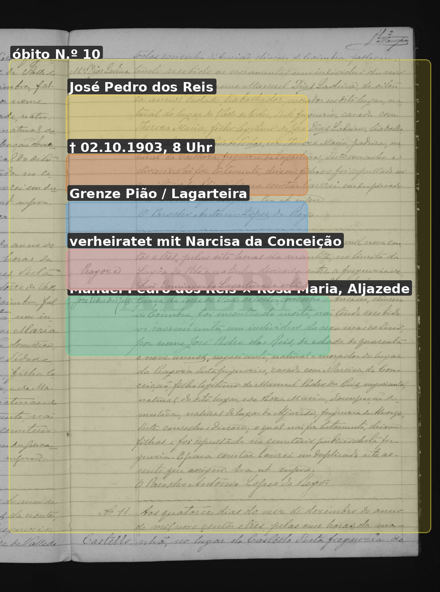

# José Pedro dos Reis

**Linie:** `narcisa` · **Gegenlese:** offen

| | |
| --- | --- |
| Quellenname | José Pedro dos Reis / Joze Pedro dos Reis |
| Rolle | 4.º avô; Kaufmann, Pragoza |
| * | 24.11.1854 · Pragoza; ~ 19.12.1854 Torre |
| † | 02.10.1903 · Linie Pião / Lagarteira |
| Eltern / genannt mit | Manoel Pedro dos Reis × Roza Maria |
| Gewissheit | Geburt, Heirat, Tod sicher |

Taufe lag bisher nur unter evidenz/scans — Kopie hier. Heirat physisch auch bei Narciza. Nicht das Ramalha-Haus (José dos Reis × Maria Ramalha).

Ausführlich: [jose-pedro-dos-reis](../../../evidenz/linie-torre/jose-pedro-dos-reis.md).

## Scan

Markierung wie bei FamilySearch: **farbige Flächen = Fundstellen** (nicht die ganze Seite). Darunter der unveränderte Scan zur Gegenlese.

🟨 Name · 🟧 Datum · 🟦 Ort · 🟩 Eltern · 🟪 Avós · 🟥 Randvermerk · 🩵 Paten (nicht Elternort)

Zum späteren Gegenlesen. Nicht neu datieren, nur die Handschrift halten.

Scan ohne Markierung — Taufe Beginn 1854

Scan ohne Markierung — Taufe Fortsetzung 1854

Scan ohne Markierung — Heirat 08.05.1878

Scan ohne Markierung — Heirat der Eltern 1851

Scan ohne Markierung — Taufe Tochter Maria 1878

Scan ohne Markierung — Óbito 02.10.1903

