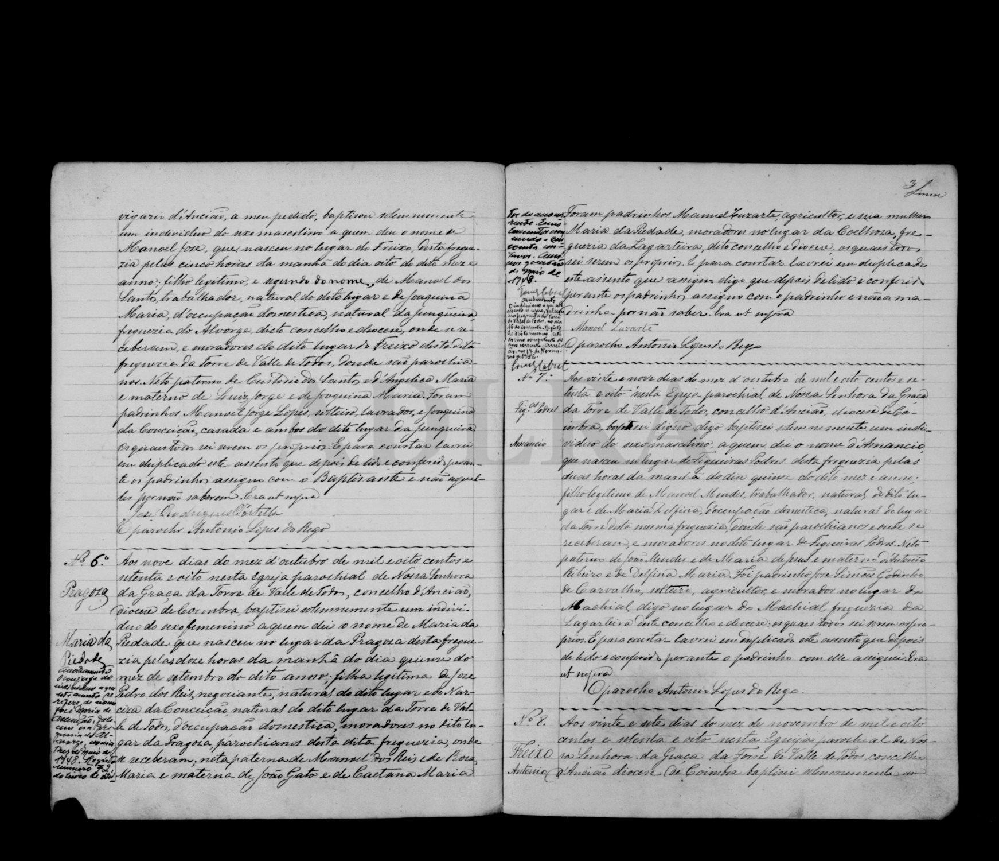

# Maria da Piedade

**Linie:** `narcisa` · **Gegenlese:** offen

| | |
| --- | --- |
| Quellenname | Maria da Piedade (ohne dos Reis im Eigennamen) |
| Rolle | 3.º avó, ramo materno |
| * | 15.09.1878 · Pragoza; ~ 09.10.1878 Torre N.º 6 |
| † | Blatt 16.01.1952 — an diesem Eintrag nicht als einzige Form; Vermerk 16./17.11.1952 Zuordnung ungeklärt |
| Eltern / genannt mit | Joze Pedro dos Reis × Narciza da Conceição |
| Gewissheit | Geburt sicher |

Eigene Taufe. Randvermerk Tod des Mannes Joze Maria da Ascenção, Alvorge Mai 1948 N.º 72.

Ausführlich: [narciza (Tochter)](../../../evidenz/linie-torre/narciza.md).

## Scan

Zum späteren Gegenlesen. Nicht neu datieren, nur die Handschrift halten.

Siehe auch:

- [Mann Joze Maria](../../jose-maria/joze-maria-da-ascencao/README.md)
