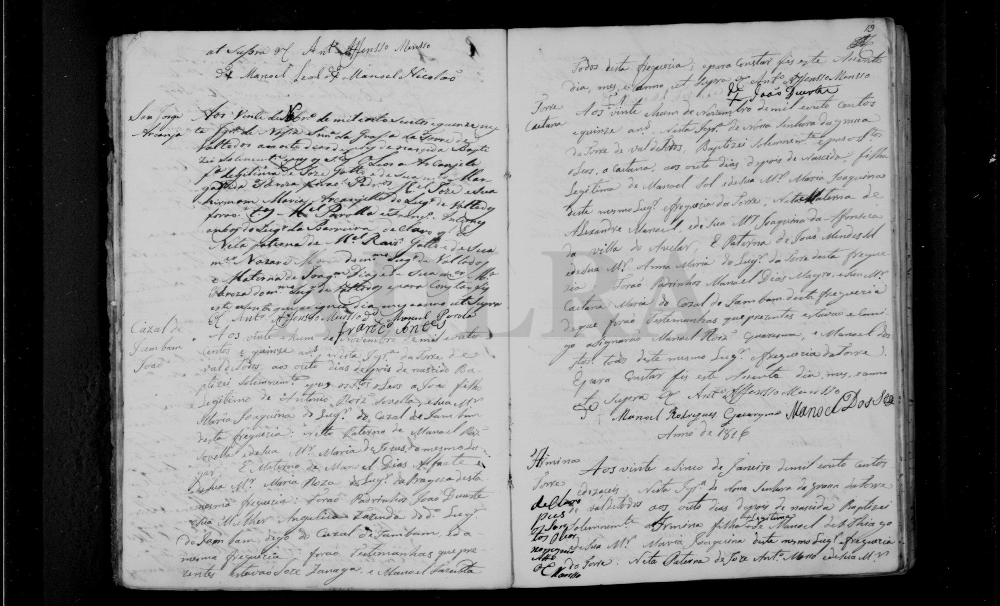

# Maria Joaquina (Sol)

**Linie:** `narcisa` · **Gegenlese:** offen

| | |
| --- | --- |
| Quellenname | Maria Joaquina |
| Rolle | Mutter Caetana |
| * | offen |
| † | offen |
| Eltern / genannt mit | Alexandre Manoel × Joaquina da Affonseca, Vila de Avelar (genannt in Caetanas Taufe) |
| Gewissheit | sicher als Mutter Caetana |

Kein eigener Akt. Nicht Theodora Maria 1781. Nicht Maria Joaquina Simões (unterer Avelar-Eintrag).

Ausführlich: [theodora-maria-1781 (Abgrenzung)](../../../evidenz/linie-torre/theodora-maria-1781.md).

## Scan

Zum späteren Gegenlesen. Nicht neu datieren, nur die Handschrift halten.

