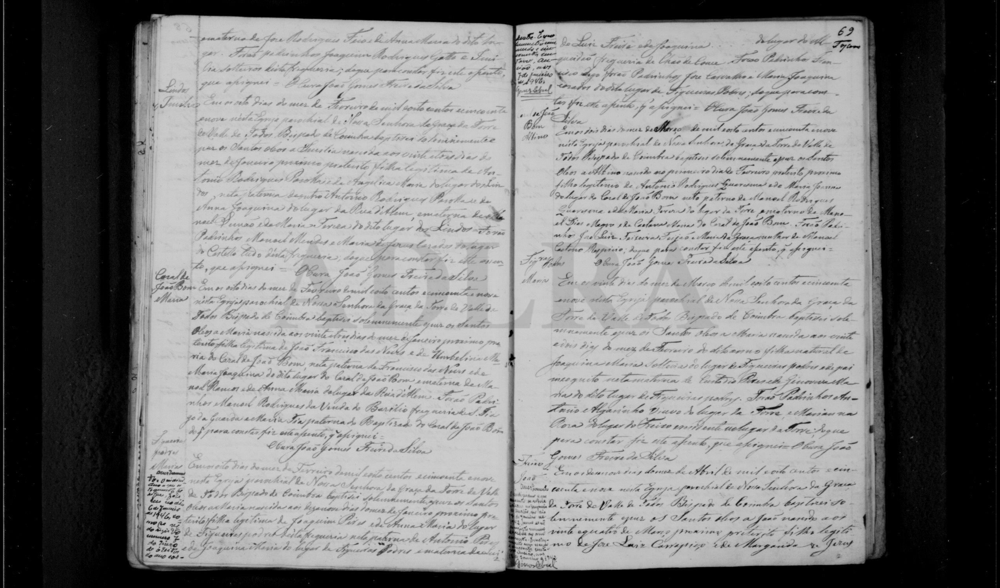
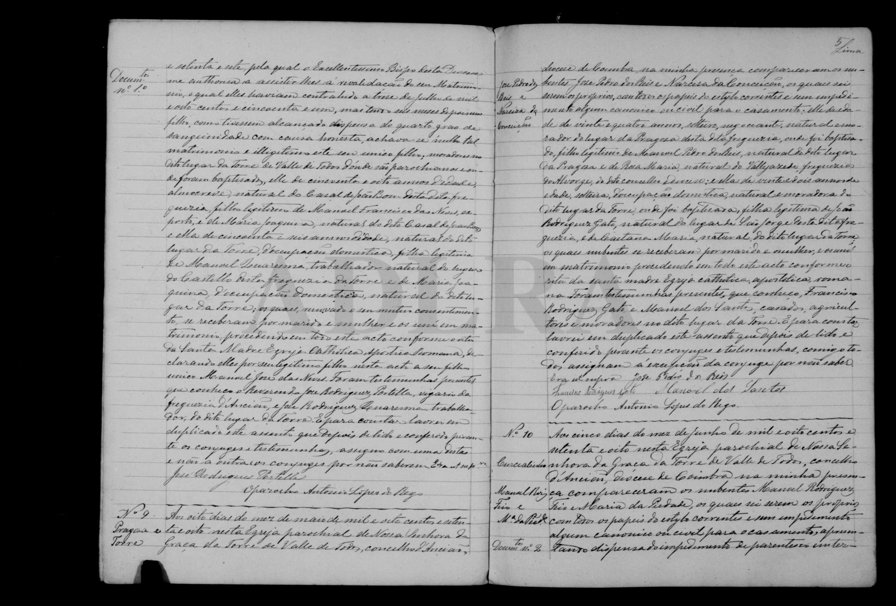
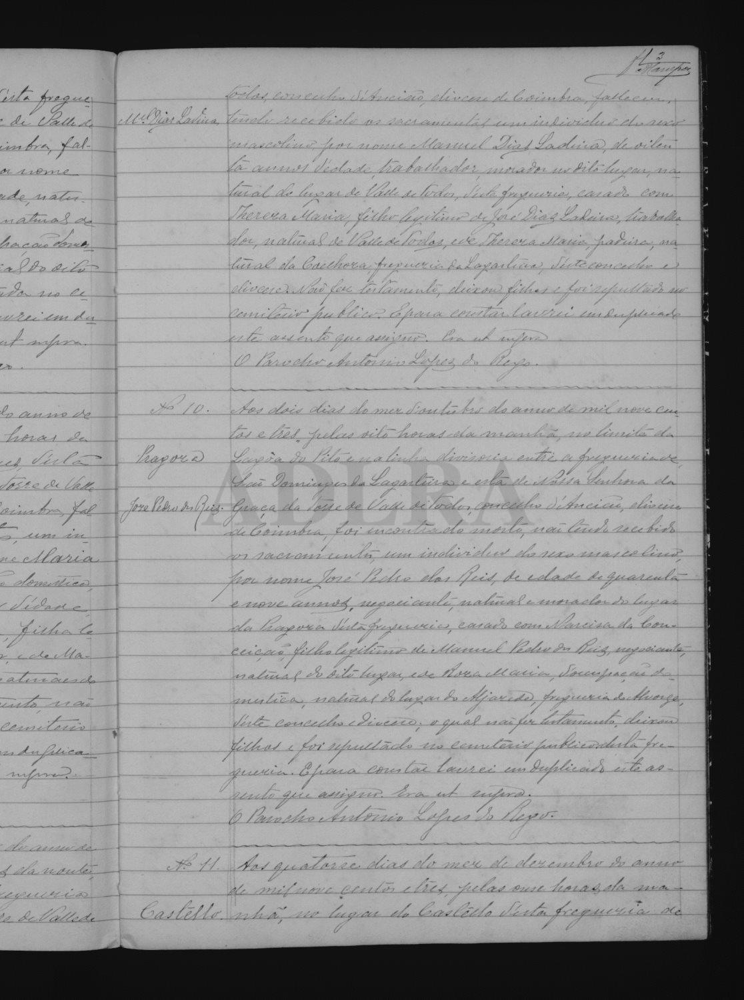

# Narciza / Narcisa da Conceição

**Linie:** `narcisa` · **Gegenlese:** offen

| | |
| --- | --- |
| Quellenname | Narciza (Taufe); Narcisa da Conceição (Heirat) |
| Rolle | 4.º avó; Torre / später Pragoza |
| * | 19.09.1856 Blatt; Tag 19. sicher, Monat wahrscheinlich Oktober; Nottaufe am Geburtstag, Ceremonien 06.11.1856 |
| † | offen (1903 noch Ehefrau; Torre bis 31.03.1911 ohne óbito) |
| Eltern / genannt mit | João Rodrigues Gato × Caetana Maria |
| Gewissheit | Taufe und Heirat 08.05.1878 sicher |

Eigene Taufe (zwei Dateien gleicher Pixelgröße — welche trägt fol. 60v–61r?) und Heirat hier. `Maria` und `dos Reis` nicht in ihren Eigennamen. Nicht Narcisa Rodrigues Gato.

Ausführlich: [narciza](../../../evidenz/linie-torre/narciza.md).

## Scan

Zum späteren Gegenlesen. Nicht neu datieren, nur die Handschrift halten.

Siehe auch:

- [José Pedro dos Reis](../jose-pedro-dos-reis/README.md)
