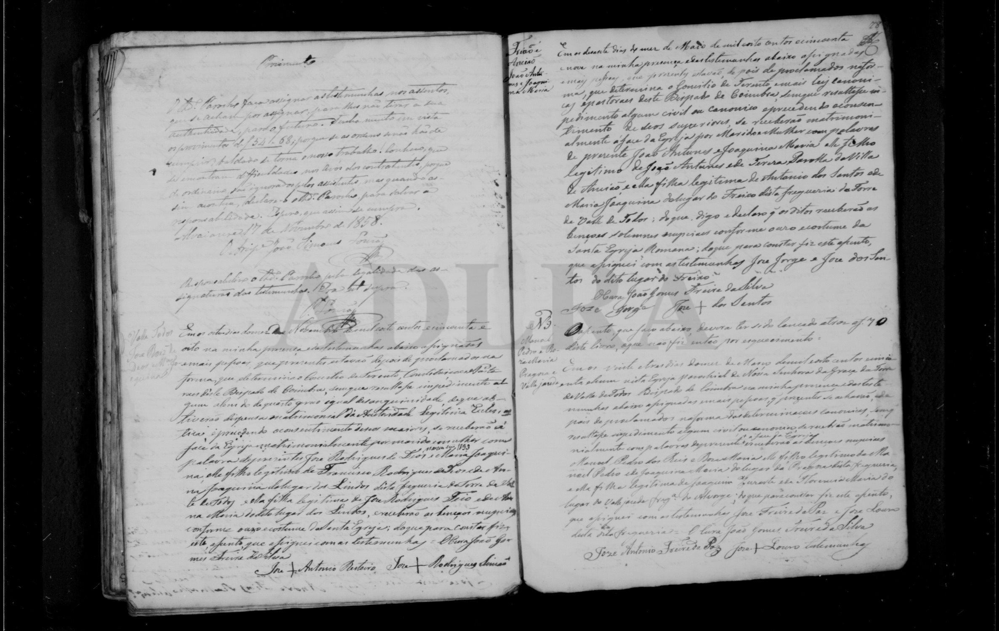

# Roza Maria

**Linie:** `narcisa` · **Gegenlese:** offen

| | |
| --- | --- |
| Quellenname | Roza Maria / Rosa Maria (Blatt * 22.04.1822 Aljazede — Taufe offen) |
| Rolle | 5.º avó; Alvorge (Vale Paio / Vallejazede / Aljazede) |
| * | Blatt 22.04.1822 · Aljazede — eigene Taufe offen |
| † | offen |
| Eltern / genannt mit | Joaquim […] × Florencia Maria, Alvorge; Nachname offen (1851 Duarte, 1854 beginnend Fre…) |
| Gewissheit | Pfarrei Alvorge sicher; * 22.04.1822 Blatt |

Kein eigener Taufakt. Ateanha ist nur Suchort, nicht ihr Weiler. Nicht mit Duarte-Linie mischen wegen Lesung Duarte 1851.

Ausführlich: [G4-paterno-reis](../../../evidenz/linie-torre/G4-paterno-reis.md).

## Scan

Markierung wie bei FamilySearch: **farbige Flächen = Fundstellen** (nicht die ganze Seite). Darunter der unveränderte Scan zur Gegenlese.

🟨 Name · 🟧 Datum · 🟦 Ort · 🟩 Eltern · 🟪 Avós · 🟥 Randvermerk · 🩵 Paten (nicht Elternort)

Zum späteren Gegenlesen. Nicht neu datieren, nur die Handschrift halten.

Scan ohne Markierung — Heirat 23.03.1851

