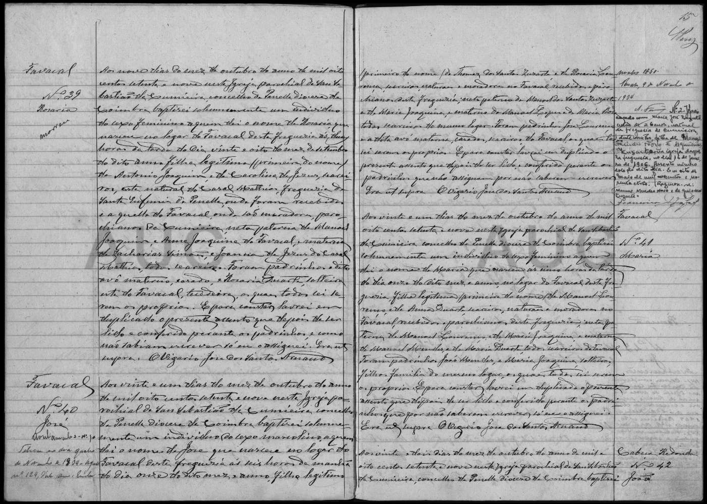

# Custodio Teixeira

**Linie:** `teixeira` · **Gegenlese:** offen

| | |
| --- | --- |
| Quellenname | Custodio Teixeira |
| Rolle | 4.º avô; Vater João 1879 |
| * | Blatt ca. 1852 · Figueiras Podres — eigene Taufe nicht gelesen |
| † | offen |
| Eltern / genannt mit | Jozé Simão Teixeira × Maria Forte (genannt 1879) |
| Gewissheit | sicher als Vater 1879; eigene Akte offen |

Kein eigener Akt. Genannt in der Taufe des Sohnes. Natürlich Figueiras Podres, wohnhaft Cabeça Redonda.

Ausführlich: [evidenz 1879-joao](../../../evidenz/linie-teixeira/1879-joao.md).

## Scan

Zum späteren Gegenlesen. Nicht neu datieren, nur die Handschrift halten.

