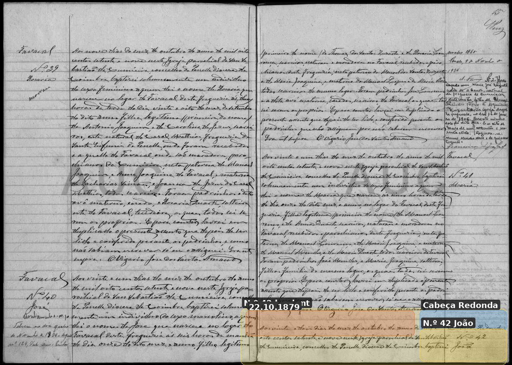

# João Teixeira (Forte)

**Linie:** `teixeira` · **Gegenlese:** offen

| | |
| --- | --- |
| Quellenname | João (Forte = Großmutter Maria Forte, nicht Taufname) |
| Rolle | 3.º avô, ramo materno |
| * | 13.10.1879 · Cabeça Redonda; ~ 22.10.1879 Cumeeira N.º 42 |
| † | offen |
| Eltern / genannt mit | Custodio Teixeira × Joana de Jesus |
| Gewissheit | sicher (Taufe) |

Eigene Taufe in diesem Ordner. Carrasqueiras / Chão de Couce nur bei den Paten — nicht mit Duarte-Carrasqueiras mischen.

Ausführlich: [evidenz 1879-joao](../../../evidenz/linie-teixeira/1879-joao.md).

## Scan

Markierung wie bei FamilySearch: **farbige Flächen = Fundstellen** (nicht die ganze Seite). Darunter der unveränderte Scan zur Gegenlese.

🟨 Name · 🟧 Datum · 🟦 Ort · 🟩 Eltern · 🟪 Avós · 🟥 Randvermerk · 🩵 Paten (nicht Elternort)

Zum späteren Gegenlesen. Nicht neu datieren, nur die Handschrift halten.

Scan ohne Markierung — Taufe Beginn N.º 42

Scan ohne Markierung — Taufe Paten / Großeltern

Siehe auch:

- [Frau Maria José](../maria-jose-dos-santos/README.md)
- [Sohn Manuel 1913](../manuel-teixeira-1913/README.md)
