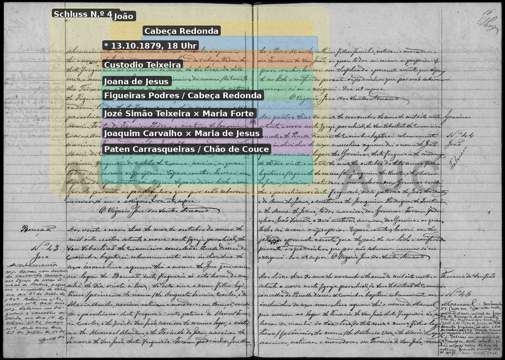

# Jozé Simão Teixeira

**Linie:** `teixeira` · **Gegenlese:** offen

| | |
| --- | --- |
| Quellenname | Jozé Simão Teixeira |
| Rolle | 5.º avô; Figueiras Podres |
| * | offen |
| † | offen |
| Eltern / genannt mit | genannt 1879 mit Maria Forte |
| Gewissheit | Paar sicher in der Taufe 1879; eigene Akte offen |

Kein eigener Akt. Blatt setzt ihn nach Cabeça Redonda; die Taufe sagt Figueiras Podres (mit Maria Forte). Formen daneben.

Ausführlich: [evidenz 1879-joao](../../../evidenz/linie-teixeira/1879-joao.md).

## Scan

Markierung wie bei FamilySearch: **farbige Flächen = Fundstellen** (nicht die ganze Seite). Darunter der unveränderte Scan zur Gegenlese.

🟨 Name · 🟧 Datum · 🟦 Ort · 🟩 Eltern · 🟪 Avós · 🟥 Randvermerk · 🩵 Paten (nicht Elternort)

Zum späteren Gegenlesen. Nicht neu datieren, nur die Handschrift halten.

Scan ohne Markierung — Taufe Enkel João, Großelternzeile

