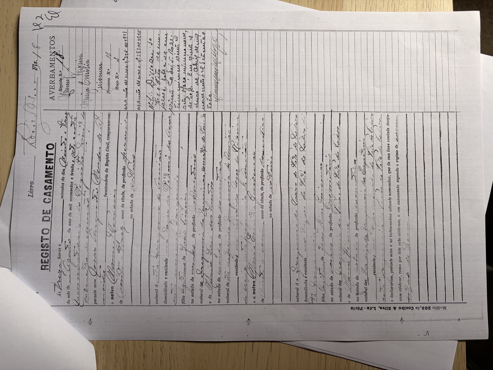
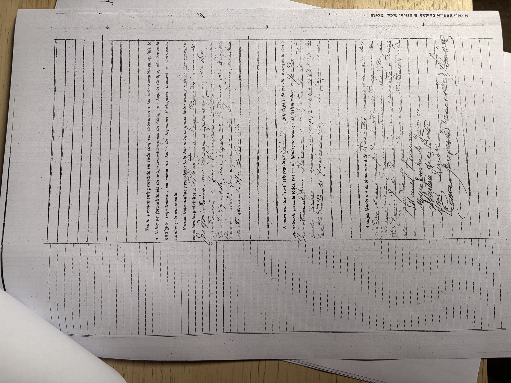

# Manuel Teixeira (* 1913)

**Linie:** `teixeira` · **Gegenlese:** offen

| | |
| --- | --- |
| Quellenname | Manuel Teixeira |
| Rolle | bisavô, ramo materno |
| * | 10.09.1913 · Ribeira de Cima, freguesia Ansião |
| † | Blatt 05.06.1973 · Angónia — hier nicht gegen Sterbeakt |
| Eltern / genannt mit | João Teixeira × Maria José dos Santos |
| Gewissheit | Geburt sicher (Zivil `01.jpg`); Tod Blatt |

Zivilstand nach 1911. Fotos bleiben in `archiv/conservatoria-ansiao/` (keine 6-MB-Kopien). Blattort Ribeira do Açor daneben — Akte Ribeira de Cima. Avós und pais nicht in diese Prüfung.

Ausführlich: [evidenz maria-jose](../../../evidenz/linie-teixeira/maria-jose-dos-santos.md).

## Scan

Zum späteren Gegenlesen. Nicht neu datieren, nur die Handschrift halten.

Geburt N.º … 10.09.1913 — liegt in der Conservatória, nicht hierher kopiert:

Heirat 23.04.1937, Beginn — liegt in der Conservatória, nicht hierher kopiert:

Heirat 23.04.1937, Schluss — liegt in der Conservatória, nicht hierher kopiert:

Siehe auch:

- [Frau Maria Emília](../../guiomar/maria-emilia-guiomar/README.md)
