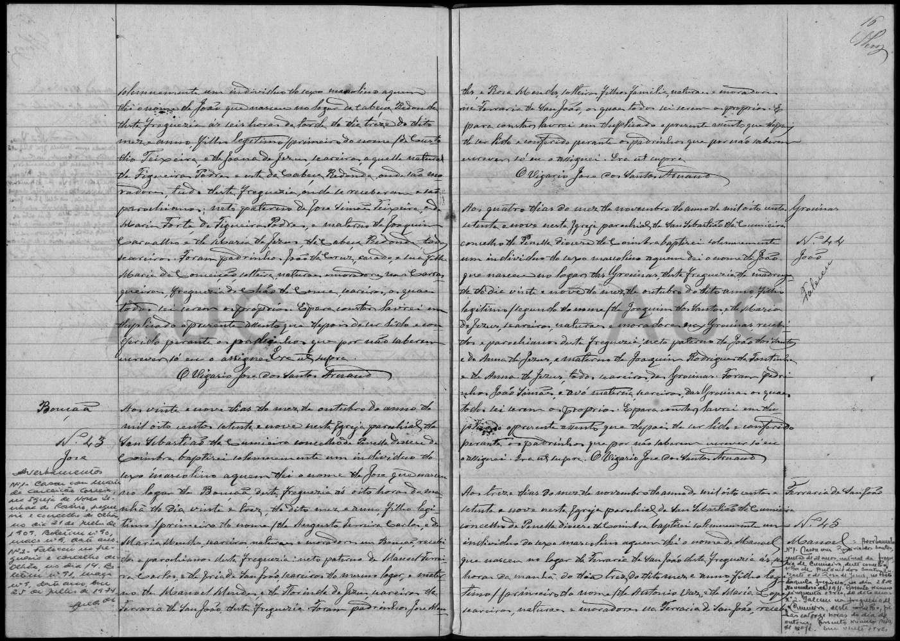

# Maria Forte

**Linie:** `teixeira` · **Gegenlese:** offen

| | |
| --- | --- |
| Quellenname | Maria Forte (nicht Fonte) |
| Rolle | 5.º avó; Namensgeberin João Teixeira (Forte) |
| * | offen |
| † | offen |
| Gewissheit | sicher genannt 1879, Figueiras Podres |

Kein eigener Akt. `Forte` steht bei ihr, nicht im Taufnamen des Enkels.

Ausführlich: [evidenz 1879-joao](../../../evidenz/linie-teixeira/1879-joao.md).

## Scan

Zum späteren Gegenlesen. Nicht neu datieren, nur die Handschrift halten.

