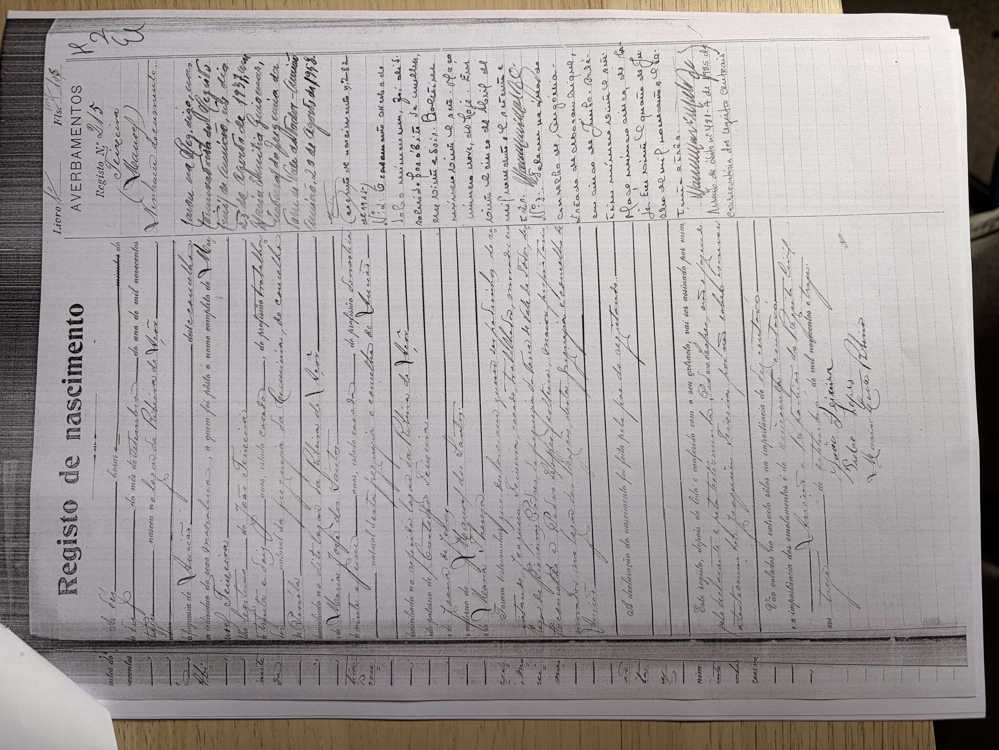

# Maria Thereza

**Linie:** `teixeira` · **Gegenlese:** offen

| | |
| --- | --- |
| Quellenname | Maria Thereza |
| Rolle | 4.º avó; Mutter Maria José |
| * | offen |
| † | offen |
| Gewissheit | sicher genannt im Zivil 1913 |

Kein eigener Akt. Nicht mit Maria Thereza Barbeiro (Pragoza, 1845) zusammenziehen.

Ausführlich: [evidenz maria-jose-dos-santos](../../../evidenz/linie-teixeira/maria-jose-dos-santos.md).

## Scan

Zum späteren Gegenlesen. Nicht neu datieren, nur die Handschrift halten.

Geburt Enkel Manuel Teixeira 1913 — liegt in der Conservatória, nicht hierher kopiert:

