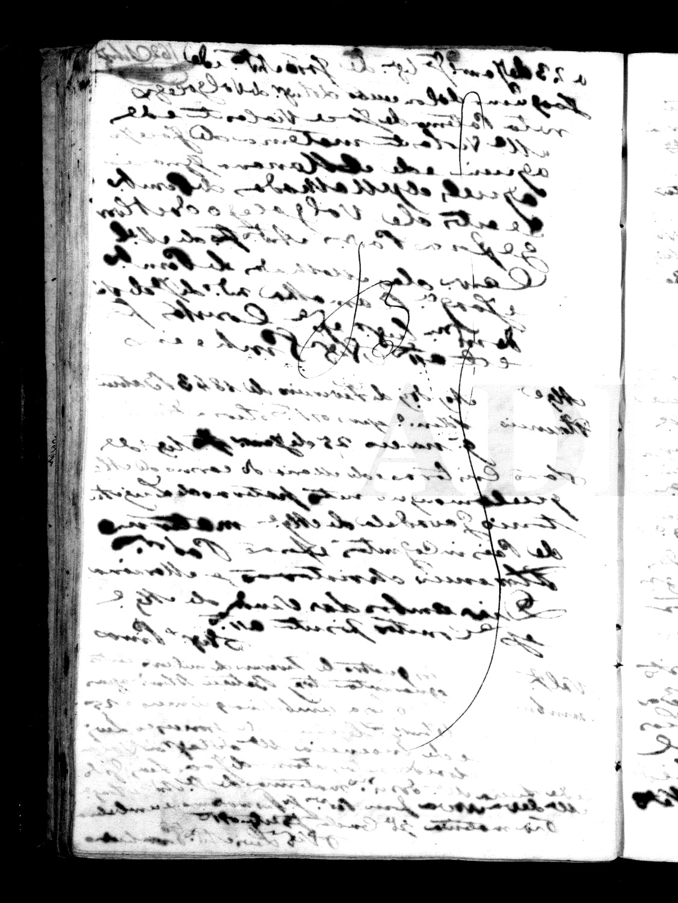
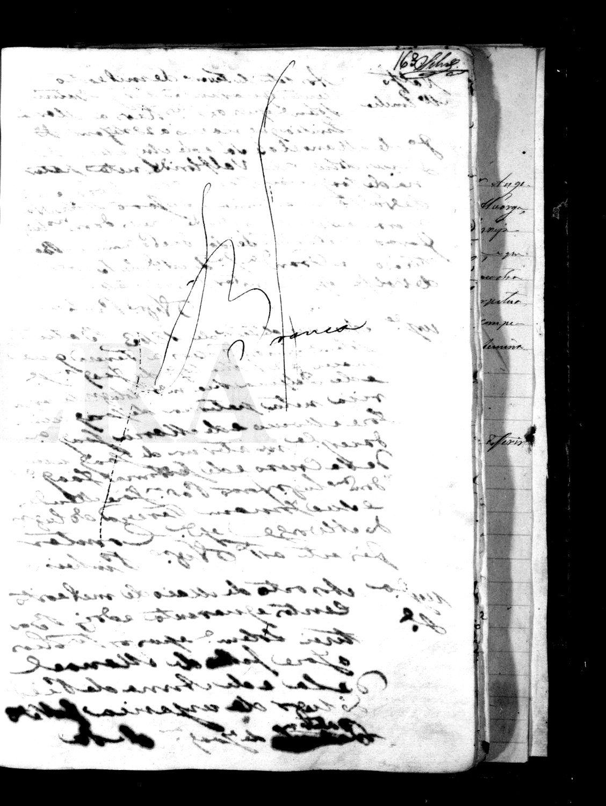
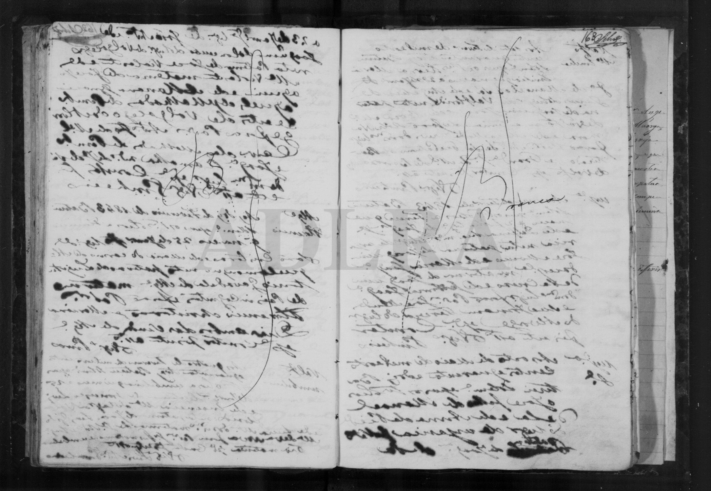
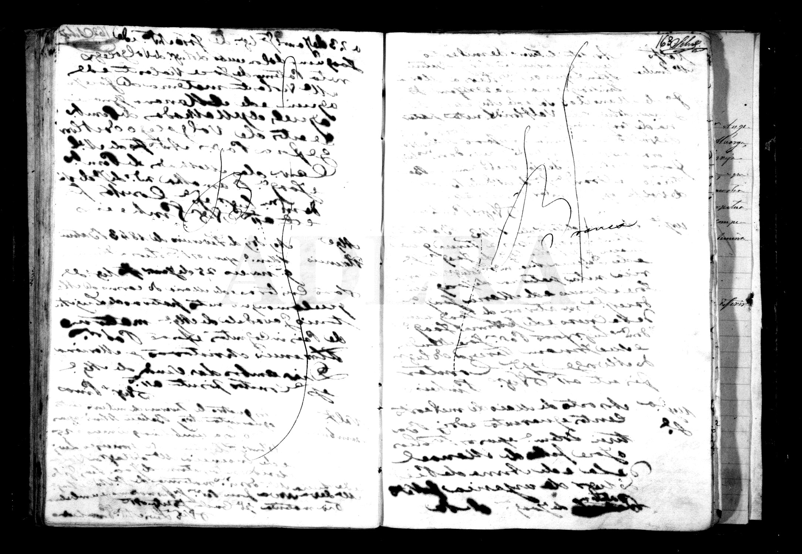
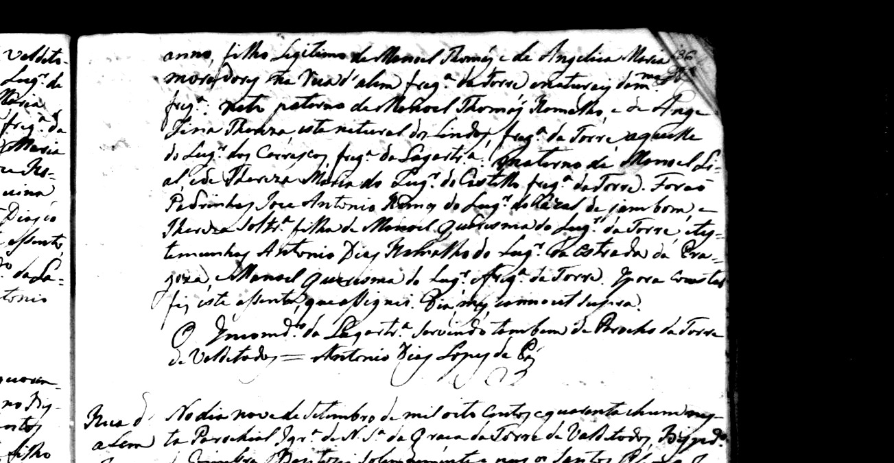

# Ramalha — nur zum Prüfen

Stand: [erkenntnisse-ramalha-reis-ateanha](erkenntnisse-ramalha-reis-ateanha.md).

Eine Seite, fünf Akten. Oben der Ausschnitt, darunter die
ganze Buchseite. **Dias** und **Ateanha** stehen in 1838/1843
nicht — das ist Absicht, nicht vergessen.

Ateanha bleibt Auftraggeber-**Kandidat**. Joaquinas Geschwister
nicht neu suchen.

---

## 1 — Heirat Februar 1838, Torre

Rechte Seite unten. Rand: `Pregoza` / `M.el Ramalho` / `Angelica M.`

**Frage:** Steht da Manoel Ramalho × Angelica, Vater der Braut
**Manoel Leal**, Ort Castello/Pregoza? Steht **Dias**? Liest die
Datumszeile **Vinte e hum** (21.) oder **Vinte dois** (22.)?

Ganze Doppelseite, markiert

Ganze Doppelseite ohne Farbe

DigitArq: [PANS08/002/0003](https://digitarq.arquivos.pt/documentDetails/6230184fe7b24cf380e3231f32271ea9)
`m0054`.

---

## 2 — José * 02.06.1843, Rua da Alom

Linke Seite oben. Rand: `Rua da Alom` / `José`.

**Frage:** Eltern Manoel **Thomaz** Ramalho × Angelica Maria?
Avós maternos **Manoel Leal** × Thereza? Derselbe Mann wie 1838 /
der Pate José 1864?

Ganze Doppelseite, markiert

Ganze Doppelseite ohne Farbe

DigitArq: [PANS08/001/0004](https://digitarq.arquivos.pt/documentDetails/156d7cb1382b42d89e362d0f4f3699a7)
`m0009`.

---

## 3 — Pate 10.06.1841, Atianha

Linke Seite oben. Kind = **Mendes**, nicht unsere Maria.

**Frage:** Pate wirklich **Manoel Ramalho**? Derselbe wie 1838?

Ohne Farbe

DigitArq: [PANS01/001/0004](https://digitarq.arquivos.pt/documentDetails/4b820d7bb81e4910a88430792e576518)
`m0146`.

---

## 4 — Alvorge m0159, blass — kein Fund

**Frage:** Siehst du Maria / Ramalho / Angelica? Ich nicht fest.
Nicht als gefunden behandeln.

Linke Hälfte (Kontrast):

Rechte Hälfte (Kontrast):

Ganze Seite roh + Kontrast

---

## 5 — Alvorge Juni 1873 — kein Joaquina-Akt

N.º 19–22: Quiteria Atianha (Mendes), Victorio Emilio, João
Junqueira, Luiz Vale Galego. Zwischen 12. und 21.06. nichts.
**Frage:** Fehlt am 15.06. wirklich jeder Eintrag?

DigitArq: [PANS01/001/0007](https://digitarq.arquivos.pt/documentDetails/4e99662172214a418bd7857a68ed45b4)
`m0170`–`m0173`.

---

## 6 — Eltern Leal, Jan 1829 Castello

**Frage:** Manoel Leal × Thereza geben Consent für Tochter
**Joaquina Maria** × Jose Dias, Castello? Schon 1829 verheiratet
(eigene Heirat also vor 1812 / nicht in diesem Band)?

Ganze Seite

---

## 7 — Schwester Maria Thereza × Freire, Alvorge, 02.06.1846

**Frage:** Braut filha de Manoel Leal × Thereza? Bräutigam aus
**Alvorge**? Das ist der Alvorge-Hebel über Leal, nicht über
Marias fehlende Taufe 1842.

Ganze Seite

---

## 8 — José primeiro * 15.08.1841, Rua da Alom

Vor dem José von 1843. **Frage:** dieselben Eltern
Manoel Thomaz × Angelica, avós Leal Castello? Erster José,
1843 dann segundo (erster tot — Kandidat)?

Ganze Seite

---

Lesung und Gewissheit daneben:
[ramalha-ateanha-1873](ramalha-ateanha-1873.md).
